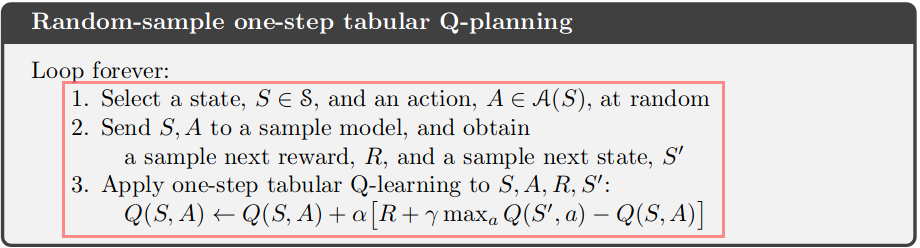

# Reinforcement Learning: An Introduction

## Chapter 4 Dynamic Programming

## Chapter 5 Monte Carlo Methods

## Chapter 6 Temporal-Difference Learning

> TD learning is a combination of Monte Carlo ideas and dynamic programming (DP) ideas. Like Monte Carlo methods, TD methods can learn directly from raw experience without a model of the environment’s dynamics. Like DP, TD methods update estimates based in part on other learned estimates, without waiting for a final outcome (they bootstrap).

> Monte Carlo methods wait until the return following the visit is known, then use that return as a target for $V(S_t)$.

$$
V(S_t) \leftarrow V(S_t) + \alpha [G_t - V(S_t)]
$$
> where $G_t$ is the actual return following time $t$, and $\alpha$ is a constant step-size parameter. This method is called *constant-$\alpha$ MC*.

> TD methods need to wait only until the next time step. At time $t+1$ they immediately form a target and make a useful update using the observed reward $R_{t+1}$ and the estimate $V(S_{t+1})$.

$$
V(S_{t}) \leftarrow V(S_t) + \alpha [R_{t+1} + \gamma V(S_{t+1}) - V(S_t)]
$$

> The target for the Monte Carlo update is $G_t$, whereas the target for the TD update is $R_{t+1} + \gamma V(S_{t+1})$. This TD method is called TD(0), or one-step TD, because it is a special case of the TD($\lambda$) and n-step TD methods developed in Chapter 12 and Chapter 7.

$$
\begin{array}{lll}
v_\pi(s) &= E_\pi[G_t|S_t=s]   \cdots \cdots \cdots \cdots \cdots \cdots \cdots \cdots  (6.3)\\
 &= E_\pi[R_{t+1} + \gamma G_{t+1} | S_t=s] \\ 
 &= E_\pi[R_{t+1} + \gamma v_\pi(S_{t+1}) | S_t=s] \cdots \cdots \cdots   (6.4)
\end{array}
$$

> Roughly speaking, Monte Carlo methods use an estimate of (6.3) as a target, whereas DP methods use an estimate of (6.4) as a target. The Monte Carlo target is an estimate because the expected value in (6.3) is not known; a sample return is used in place of the real expected return. The DP target is an estimate not because of the expected values, which are assumed to be completely provided by a model of the environment, but because $V_\pi(S_{t+1})$ is not known and the current estimate, $V_\pi(S_{t+1})$, is used instead. The TD target is an estimate for both reasons: it samples the expected values in (6.4) and it uses the current estimate $V$ instead of the true $v_\pi$. Thus, TD methods combine the sampling of Monte Carlo with the bootstrapping of DP.

> *Sample updates* differ from the *expected updates* of DP methods in that they are based on a single sample successor rather than on a complete distribution of all possible successors.

> TD methods have an advantage over DP methods in that they do not require a model of the environment, of its reward and next-state probability distributions.

> With Monte Carlo methods one must wait until the end of an episode, because only then is the return known, whereas with TD methods one need wait only one time step.

> The other reasonable answer is simply to observe that we have seen $A$ once and the return that followed it was 0; we therefore estimate $V(A)$ as 0. This is the answer that batch Monte Carlo methods give. Notice that it is also the answer that gives minimum squared error on the training data. We expect that the first answer will produce lower error on future data, even though the Monte Carlo answer is better on the existing data.

> Batch Monte Carlo methods always find the estimates that minimize mean-squared error on the training set, whereas batch TD(0) always finds the estimates that would be exactly correct for the maximum-likelihood model of the Markov process.

### SARSA: On-policy TD Control

$$
Q(S_t, A_t) \leftarrow Q(S_t, A_t) + \alpha (R_{t+1} + \gamma Q(S_{t+1}, A_{t+1}) - Q(S_t, A_t))
$$

> This rule uses every element of the quintuple of events, ($S_t$,$A_t$,$R_{t+1}$,$S_{t+1}$,$A_{t+1}$), that make up a transition from one state–action pair to the next.

### Q-Learning: Off-policy TD Control

$$
Q(S_t, A_t) \leftarrow Q(S_t, A_t) + \alpha (R_{t+1} + \max_a Q(S_{t+1}, a) - Q(S_t, A_t))
$$

### Expected Sarsa

$$
Q(S_t, A_t) \leftarrow Q(S_t, A_t) + \alpha (R_{t+1} + \sum_a \pi(a|S_t) Q(S_t, a) - Q(S_t, A_t))
$$

### Maximization Bias and Double Learning

> One way to view the problem is that it is due to using the same samples (plays) both to determine the maximizing action and to estimate its value.

$$
Q_1(S_t, A_t) \leftarrow Q_1(S_t, A_t)+ \alpha(R_{t+1} + \gamma Q_2(S_{t+1}, \argmax_a Q_1(S_{t+1}, a)) - Q_1(S_t, A_t) )
$$

### The backup diagrams of the above algorithms

## Chapter 7 n-step Boostrapping

>In many applications one wants to be able to update the action very fast to take into account anything that has changed, but bootstrapping works best if it is over a length of time in which a significant and recognizable state change has occurred.

### n-step prediction

>One kind of intermediate method, then, would perform an update based on an intermediate number of rewards: more than one, but less than all of them until termination. For example, a two-step update would be based on the first two rewards and the estimated value of the state two steps later.

> Methods in which the temporal difference extends over n steps are called n-step TD methods.

$$
G_{t:t+n} = R_{t+1} + \gamma R_{t+2} + \dots + \gamma ^ {n-1} R_{t+n} + \gamma ^{n} V_\pi(S_{t+n})
$$

$$
V_\pi(S_t) = V_\pi(S_t) + \alpha (G_{t:t+n} - V_\pi(S_t))
$$

> All $n$-step returns can be considered approximations to the full return, truncated after $n$ steps and then corrected for the remaining missing terms by $V(S_{t+n})$.

> No real algorithm can use the $n$-step return until after it has seen $R_{t+n}$ and computed $V_\pi(S_{t+n})$.

> The $n$-step TD methods thus form a family of sound methods, with one-step TD methods and Monte Carlo methods as extreme members.

### n-step SARSA

$$
G_{t:t+n} = R_{t+1} + \gamma R_{t+2} + \dots + \gamma ^ {n-1} R_{t+n} + \gamma ^{n} Q_\pi(S_{t+n}, A_{t+n})
$$

$$
Q_\pi(S_t, A_t) = Q_\pi(S_t, A_t) + \alpha (G_{t:t+n} - Q_\pi(S_t, A_t))
$$

### n-step Q-Learning

$$
G_{t:t+n} = R_{t+1} + \gamma R_{t+2} + \dots + \gamma ^ {n-1} R_{t+n} + \gamma ^{n} \max _a Q_\pi(S_{t+n}, a)
$$

$$
Q_\pi(S_t, A_t) = Q_\pi(S_t, A_t) + \alpha (G_{t:t+n} - Q_\pi(S_t, A_t))
$$

### n-step off-policy learning

#### Prediction

$$
G_{t:t+n} = R_{t+1} + \gamma R_{t+2} + \dots + \gamma ^ {n-1} R_{t+n} + \gamma ^{n} V_\pi(S_{t+n})
$$

$$
V_\pi(S_t) = V_\pi(S_t) + \alpha \rho_{t:t+n-1} (G_{t:t+n} - V_\pi(S_t))
$$

#### Control

$$
G_{t:t+n} = R_{t+1} + \gamma R_{t+2} + \dots + \gamma ^ {n-1} R_{t+n} + \gamma ^{n} Q_\pi(S_{t+n}, A_{t+n})
$$

$$
Q_\pi(S_t, A_t) = Q_\pi(S_t, A_t) + \alpha \rho_{t+1:t+n} (G_{t:t+n} - Q_\pi(S_t, A_t))
$$

#### $n$-step $Q(\sigma)$

## Chapter 8 Planning and Learning with Tabular Methods

> These are respectively called model-based and model-free reinforcement learning methods. Model-based methods rely on planning as their primary component, while model-free methods primarily rely on learning.

> By a *model* of the environment we mean anything that an agent can use to predict how the environment will respond to its actions.

> Some models produce a description of all possibilities and their probabilities; these we call *distribution models*. Other models produce just one of the possibilities, sampled according to the probabilities; these we call *sample models*.

> Given a starting state and action, a sample model produces a possible transition, and a distribution model generates all possible transitions weighted by their probabilities of occurring.
Given a starting state and a policy, a sample model could produce an entire episode, and a distribution model could generate all possible episodes and their probabilities.
In either case, we say the model is used to simulate the environment and produce simulated experience. 

> The word planning is used in several different ways in different fields. We use the term to refer to any computational process that takes a model as input and produces or improves a policy for interacting with the modeled environment.

> *State-space planning*, which includes the approach we take in this book, is viewed primarily as a search through the state space for an optimal policy or an optimal path to a goal.

> It takes the rest of the chapter to develop this view, but there are two basic ideas: (1) all state-space planning methods involve computing value functions as a key intermediate step toward improving the policy, and (2) they compute value functions by updates or backup operations applied to simulated experience.

> The heart of both learning and planning methods is the estimation of value functions by backing-up update operations. The difference is that whereas planning uses simulated experience generated by a model, learning methods use real experience generated by the environment.

### Dyna: Integrated Planning, Acting, and Learning

> New information gained from the interaction may change the model and thereby interact with planning.

> Within a planning agent, there are at least two roles for real experience: it can be used to improve the model (to make it more accurately match the real environment) and it can be used to directly improve the value function and policy using the kinds of reinforcement learning methods we have discussed in previous chapters. The former we call *model-learning*, and the latter we call *direct reinforcement learning* (direct RL).

> Indirect methods often make fuller use of a limited amount of experience and thus achieve a better policy with fewer environmental interactions. On the other hand, direct methods are much simpler and are not affected by biases in the design of the model.

> The model is learned from real experience and gives rise to simulated experience. We use the term *search control* to refer to the process that selects the starting states and actions for the simulated experiences generated by the model. Finally, planning is achieved by applying reinforcement learning methods to the simulated experiences just as if they had really happened.

> Learning and planning are deeply integrated in the sense that they share almost all the same machinery, di↵ering only in the source of their experience.

> In the pseudocode algorithm for Dyna-Q in the box below, $Model(s, a)$ denotes the contents of the (predicted next state and reward) for state–action pair $(s, a)$.

> In Dyna-Q, learning and planning are accomplished by exactly the same algorithm, operating on real experience for learning and on simulated experience for planning.
> As new information is gained, the model is updated to better match reality. As the model changes, the ongoing planning process will gradually compute a different way of behaving to match the new model.

### When the Model Is Wrong

> Models may be incorrect because the environment is stochastic and only a limited number of samples have been observed, or because the model was learned using function approximation that has generalized imperfectly, or simply because the environment has changed and its new behavior has not yet been observed.

> In a planning context, exploration means trying actions that improve the model, whereas exploitation means behaving in the optimal way given the current model. We want the agent to explore to find changes in the environment, but not so much that performance is greatly degraded.

> To encourage behavior that tests long-untried actions, a special “bonus reward” is given on simulated experiences involving these actions. In particular, if the modeled reward for a transition is $r$, and the transition has not been tried in $\tau$ time steps, then planning updates are done as if that transition produced a reward of $r+k\sqrt \tau$ , for some small $k$.

### Prioritized Sweeping

> Simulated transitions are started in state–action pairs selected uniformly at random from all previously experienced pairs. But a uniform selection is usually not the best; planning can be much more efficient if simulated transitions and updates are focused on particular state–action pairs.

> If simulated transitions are generated uniformly, then many wasteful updates will be made before stumbling onto one of these useful ones. In the much larger problems that are our real objective, the number of states is so large that an unfocused search would be extremely inefficient.

> Suppose now that the agent discovers a change in the environment and changes its estimated value of one state, either up or down. Typically, this will imply that the values of many other states should also be changed, but the only useful one-step updates are those of actions that lead directly into the one state whose value has been changed. This general idea might be termed *backward focusing of planning computations*.

> We have suggested in this chapter that all kinds of state-space planning can be viewed as **sequences of value updates, varying only in the type of update, expected or sample, large or small, and in the order in which the updates are done.**

> For example, another would be to focus on states according to how easily they can be reached from the states that are visited frequently under the current policy, which might be called forward focusing.

### Expected VS Sample Updates

> In the absence of a distribution model, expected updates are not possible, but sample updates can be done using sample transitions from the environment or a sample model.

Sample Update

$$
Q(S_t=s, A_t=a) \leftarrow Q(S_t=s, A_t=a) + \alpha (R_{t+1} + \gamma Q(S_{t+1}=s', A_{t+1}=a') - Q(S_t=s, A_t=a)) 
$$

Expected Update

$$
Q(S_t=s, A_t=a) = \sum_{s', r} p(S_{t+1}=s', R_{t+1}=r | S_t=s, A_t=a)(r+\gamma \sum_{a'}\pi(A_{t+1}=a'|S_{t+1}=s')Q(S_{t+1}=s', A_{t+1}=a'))
$$

> **In favor of the expected update is that it is an exact computation, resulting in a new $Q(s, a)$ whose correctness is limited only by the correctness of the $Q(s', a')$ at successor states. The sample update is in addition affected by sampling error. On the other hand, the sample update is cheaper computationally because it considers only one next state, not all possible next states.**

> For a particular starting pair, $s$, $a$,let $b$ be the **branching factor** (i.e., the number of possible next states, $s'$, for which $ \hat p(s' |s, a) > 0)$. Then an expected update of this pair requires roughly $b$ times as much computation as a sample update.

> **If there is enough time to complete an expected update, then the resulting estimate is generally better than that of b sample updates because of the absence of sampling error. But if there is insuffcient time to complete an expected update, then sample updates are always preferable because they at least make some improvement in the value estimate with fewer than $b$ updates.**

> In a real problem, the values of the successor states would be estimates that are themselves updated. By causing estimates to be more accurate sooner, sample updates will have a second advantage in that **the values backed up from the successor states will be more accurate**. These results suggest that sample updates are likely to be superior to expected updates on problems with large stochastic branching factors and too many states to be solved exactly.

### Trajectory Sampling

> The classical approach, from dynamic programming, is to perform sweeps through the entire state (or state–action) space, updating each state (or state–action pair) once per sweep.

> This is problematic on large tasks because there may not be time to complete even one sweep. In many tasks the vast majority of the states are irrelevant because they are visited only under very poor policies or with very low probability.

> The second approach is to sample from the state or state–action space according to some distribution.

> More appealing is to distribute updates according to the on-policy distribution, that is, according to the distribution observed when following the current policy.

> **In either case, sample state transitions and rewards are given by the model, and sample actions are given by the current policy. One simulates explicit individual trajectories and performs updates at the state or state–action pairs encountered along the way. We call this way of generating experience and updates trajectory sampling.**

> In the short term, sampling according to the on-policy distribution helps by focusing on states that are near descendants of the start state. If there are many states and a small branching factor, this effect will be large and long-lasting. In the long run, focusing on the on-policy distribution may hurt because the commonly occurring states all already have their correct values. Sampling them is useless, whereas sampling other states may actually perform some useful work. This presumably is why the exhaustive, unfocused approach does better in the long run, at least for small problems.

> They do suggest that sampling according to the on-policy distribution can be a great advantage for large problems, **in particular for problems in which a small subset of the state–action space is visited under the on-policy distribution.**

### Planning at Decision Time

> The one we have considered so far in this chapter, typified by dynamic programming and Dyna, is to use planning to gradually improve a policy or value function **on the basis of simulated experience** obtained from a model (either a sample or a distribution model).

> These two ways of thinking about planning—using simulated experience to gradually improve a policy or value function, or using simulated experience to select an action for the current state.

> **Decision-time planning** is most useful in applications in which fast responses are not required. In chess playing programs, for example, one may be permitted seconds or minutes of computation for each move, and strong programs may plan dozens of moves ahead within this time. On the other hand, if low latency action selection is the priority, then one is generally better off doing planning in the background  (**background planning**) to compute a policy that can then be rapidly applied to each newly encountered state.

## Chapter 9 On-policy Prediction with Approximation

> Consequently, when a single state is updated, the change generalizes from that state to affect the values of many other states.

> All of the prediction methods covered in this book have been described as updates to an estimated value function that shift its value at particular states toward a “backed-up value,” or update target, for that state.

$$
S_t \rightarrow G_t
$$

$$
S_t \rightarrow R_{t+1} + \gamma V_\pi(S_{t+1}; w)
$$

$$
S_t \rightarrow G_{t:t+n}
$$

$$
S_t \rightarrow G_t^\lambda
$$

$$
s \rightarrow E_\pi[R_{t+1} + \gamma V_\pi(S_{t+1}; w) | S_t=s]
$$

> The update $s\rightarrow u$ means that the estimated value for state s should be more like the update target u.

> Up to now, the actual update has been trivial: the table entry for $S$’s estimated value has simply been shifted a fraction of the way toward $U$, and the estimated values of all other states were left unchanged.

> Moreover, the learned values at each state were decoupled—an update at one state affected no other. But with genuine approximation, an update at one state affects many others, and **it is not possible to get the values of all states exactly correct.**

> By assumption we have far more states than weights, **so making one state’s estimate more accurate invariably means making others’ less accurate.**

> Mean Squared Value Error: often $\mu(s)$ is chosen to be the fraction of time spent in S.Under on-policy training this is called on-policy distribution. 

$$
\overline{VE}(w) = \sum_s \mu(s)(V_\pi(s) - \hat V(s; w))^2
$$

> Stochastic gradient-descent (SGD) methods do this by adjusting the weight vector after each example by a small amount in the direction that would most reduce the error on that example:

$$
\begin{array}{ll}
w_{t+1} &= w_t + \frac{1}{2} \alpha (V_\pi(s) - \hat V(s; w)) \\
 &= w_t + \alpha (V_\pi(s) - \hat V(s; w)) \nabla_w \hat V(s; w)
\end{array}
$$

> Remember that we do not seek or expect to find a value function that has zero error for all states, but only an approximation that balances the errors in different states.

> We turn now to the case in which the target output, here denoted $U_t \in R$, of the $t$-th training example, $S_t \rightarrow U_t$, is not the true value, $V_\pi(S_t)$, but some, possibly random, approximation to it.

$$
w_{t+1} = w_{t} + \alpha(U_t - V_\pi(S_t;w)) \nabla_w V_\pi(S_t; w)
$$

* They take into account the effect of changing the weight vector $w_t$ on the estimate, but ignore its effect on the target. They include only a part of the gradient and, accordingly, we call them semi-gradient methods.

$$
w_{t+1} = w_{t} + \alpha (R_{t+1} + \gamma V_\pi(S_{t+1}; w) - V_\pi(S_{t}; w)) \nabla_w V_\pi(S_t; w)
$$

## Chapter 10 On-policy Control with Approximation

### Episodic Semi-gradient SARSA

$$
\delta = R_{t+1} + Q_\pi(S_{t+1}, A_{t+1}; w) - Q_\pi(S_t, A_t; w)
$$

$$
w_t = w_t + \alpha\delta \nabla_w Q_\pi(S_t, A_t; w)
$$

### Episodic n-step Semi-gradient SARSA

$$
G_{t:t+n} = R_{t+1} + \gamma R_{t+2} + \dots + \gamma ^ {n-1} R_{t+1} + \gamma ^nQ_\pi(S_{t+n}, A_{t+n}; w)
$$

$$
\delta = G_{t:t+n} - Q(S_t, A_t; w)
$$

$$
w_t = w_t + \alpha \delta \nabla_w Q_\pi(S_t, A_t; w)
$$

### Differential Semi-gradient SARSA (using average reward for continuing problem)

> The average reward setting applies to continuing problems, problems for which the interaction between agent and environment goes on and on forever without termination or start states.

**differential return**

$$
G_t = R_{t+1} - \hat R + R_{t+2} - \hat R + R_{t+3} - \hat R + \dots
$$

**differential state-value function**

$$
V_\pi(s) = \sum_a \pi(a|s) \sum_{r, s'}p(r, s'|s, a)(r - \overline r + \gamma V_pi(s'))
$$

**differential action-value function**

$$
Q_\pi(s, a) = \sum_{r, s'} p(r, a'|s, a)(r - \overline r +\gamma V_\pi(s')))
$$

$$
Q_\pi(s, a) = \sum_{r, s'} p(r, a'|s, a)(r - \overline r +\gamma \sum_{a'}\pi(a'|s')Q(a', s')))
$$

TD errors:

$$
G_{t:t+1} = R_{t+1} - \overline R + Q_\pi(S_{t+1}, A_{t+1}; w)
$$

$$
\delta = G_{t:t+1} - Q(S_t, A_t; w)
$$

$$
w_t = w_t + \alpha \delta \nabla_wQ(S_t, A_t; w)
$$

### Differential Semi-gradient n-step SARSA (using average reward for continuing problem)

$$
G_{t:t+n} = R_{t+1} - \overline R + R_{t+2} - \overline R + R_{t+3} - \overline R + \dots + Q_\pi(S_{t+n}; A_{t+n}; w)
$$

$$
\delta = G_{t:t+n} - Q_\pi(S_t, A_t; w)
$$

$$
w_t = w_t + \alpha \delta \nabla_w Q(S_t, A_t; w)
$$

## Chpater 12 Eligibility Traces

### $\lambda$-return

This section introduction a new kind of update target $G_t^\lambda$.

#### Prediction Problem

$$
G_{t:t+n} = R_{t+1} + \gamma R_{t+2} + \dots + \gamma^{n-1} R_{t+n} + \gamma^n v_\pi(S_{t+1;w})
$$

> If $\lambda = 0$, then the overall update reduces to its first component, the one-step TD update, whereas if $\lambda=1$, then the overall update reduces to its last component, the Monte Carlo update.

$$
G_t^\lambda = (1-\lambda) \sum_{n=1}^\infty \lambda ^ n G_{t:t+n}
$$

**off-line update**  

$$
w_t = w_t + \alpha \times (G_t^\lambda - v_\pi(S_t; w)) \nabla_w v_\pi(S_t; w)
$$

#### Control Problem

$$
G_{t:t+n} = R_{t+1} + \gamma R_{t+2} + \dots + \gamma^{n-1} R_{t+n} + \gamma ^n Q_\pi(S_{t+n}, A_{t+n}; w)
$$

$$
G_t^\lambda = (1-\lambda)\sum_{n=1}^\infty \lambda^{n-1}G_{t:t+n}
$$

**off-line update** 

$$
w_t = w_t + \alpha (G_t^\lambda - Q(S_t, A_t; w)) \nabla_w Q(S_t, A_t; w)
$$

### TD($\lambda$)

> The weight vector is a long-term memory, accumulating over the lifetime of the system, the eligibility trace is a short-term memory, typically lasting less time than the length of an episode.

#### Prediction Problem

An interaction trajectory with $S_t$, $A_t$, $R_{t+1}$, $S_{t+1}$, and $A_{t+1}$.

$$
z_{-1} = 0
$$

$$
z_{t} = \gamma \lambda z_{t-1} + \nabla_w V_\pi (S_t; w) 
$$

$$
\delta = R_{t+1} + \gamma V_\pi(S_{t+1}) - V_\pi(S_t)
$$

$$
w_t = w_t + \alpha \delta z_{t}
$$

> At each moment we look at the current TD error and assign it backward to each prior state according to how much that state contributed to the current eligibility trace at that time.

> If $\lambda=0$, then by $
z_{t} = \gamma \lambda z_{t-1} + \nabla_w V_\pi (S_t; w) 
$ the trace at $t$ is exactly the value gradient corresponding to $S_t$.Thus the TD($\lambda$) update (12.7) reduces to the one-step semi-gradient TD update treated in Chapter 9 (and, in the tabular case, to the simple TD rule (6.2)). This is why that algorithm was called TD(0).

> We say that the earlier states are given less **credit** for the TD error.

#### Control Problem SARSA($\lambda$)

An interaction trajectory with $S_t$, $A_t$, $R_{t+1}$, $S_{t+1}$, and $A_{t+1}$.

$$
z_{-1} = 0
$$

$$
z_t = \gamma \lambda z_{t-1} + \nabla_w Q(S_{t+1}, A_{t+1}; w)
$$

$$
\delta = R_{t+1} + \gamma Q(S_{t+1}, A_{t+1}; w) - Q(S_t, A_t; w)
$$

$$
w_t = w_t + \alpha \delta z_t
$$

## Chapter 13 Policy Gradient Methods

The target of policy gradient methods and the on-policy value approximation methods are listed below.

$$
L(w) = E_{s, a}[Q_\pi(s, a) - \hat Q(s, a; w)]^2
$$

$$
J(\theta) = E_{s_0 \in \mu(s_0)}[V_\pi(s_0)]
$$

$$
\theta_{t+1} = \theta_t + \alpha \nabla_\theta J(\theta)
$$

> Methods that learn approximations to both policy and value functions are often called actor–critic methods, where ‘actor’ is a reference to the learned policy, and ‘critic’ refers to the learned value function, usually a state-value function.

### Policy Gradient Theorem

$$
\nabla_\theta v_\pi(s) = \sum_{x \in S}\sum_{k=0}^\infty Pr(s \rightarrow x, k, \pi) \sum_a \nabla_\theta \pi_\theta(a|x) q_\pi(x, a)
$$

$$
\nabla J(\theta) = \nabla v_\pi(S_0) \varpropto  \sum_s \mu(s) \sum_a \nabla \pi(a|s) Q_\pi(s, a)
$$

$$
\mu(s) = \frac{\eta(s)}{\sum_{s'}\eta(s')}
$$

$$
\eta(s) = \sum_{k=0}^\infty Pr(s_0 \rightarrow s, k, \pi)
$$

> $Pr(s_0 \rightarrow s, k, \pi)$ is the probability of transitioning from state $s_0$ to state $s$ in $k$ steps under policy.

$$
\nabla J(\theta) \varpropto  \sum_s \mu(s) \sum_a \nabla \pi(a|s) Q_\pi(s, a)
$$

### REINFORCE: Monte Carlo Policy Gradient

$$
\nabla J(\theta) \varpropto  \sum_s \mu(s) \sum_a \nabla \pi(a|s) Q_\pi(s, a) \\
$$

$$
\nabla J(\theta) = E_{\mu(s)}[\sum_a Q_\pi(s, a)\nabla \pi(a|s; \theta)]
$$

$$
\theta_{t+1} = \theta_t + \alpha \sum_a  Q(S_t, a) \nabla \pi(a|S_t; \theta)
$$

> This algorithm, which has been called an **all-actions method** because its update involves all of the actions, is promising and deserving of further study, but our current interest is the classical **REINFORCE algorithm** (Willams, 1992) whose update at time $t$ involves just $A_t$, the one action actually taken at time $t$.

$$
\begin{array}{ll}
\nabla J(\theta) &= E_{s \in \mu(s)}\lbrack\sum_a \pi(a|s; \theta) Q_\pi(s, a) \frac{\nabla \pi(a|s; \theta)}{\pi(a|s; \theta)}\rbrack \\
&=E_{s \in \mu(s), a \in \pi(a|s)}[Q_\pi(s, a) \frac{\nabla \pi(a|s; \theta)}{\pi(a|s; \theta)}] \\
&= E_{s \in \mu(s), a \in \pi(a|s)}[G_t \frac{\nabla \pi(a|S_t; \theta)}{\pi(a|S_t; \theta)}]
\end{array}
$$

**REINFORCE update**

$$
\theta_{t+1} = \theta_t + \alpha G_t \frac{\nabla \pi(a|S_t; \theta)}{\pi(a|S_t; \theta)}
$$

> The vector is the direction in parameter space that most increases the probability of repeating the action $A_t$ on future visits to state $S_t$. The update increases the parameter vector in this direction proportional to the return, and inversely proportional to the action probability. The former makes sense because it causes the parameter to move most in the directions that favor actions that yield the highest return. The latter makes sense because otherwise actions that are selected frequently are at an advantage (the updates will be more often in their direction) and might win out even if they do not yield the highest return.

### REINFORCE with Baseline

$$
\nabla J(\theta) \varpropto  \sum_s \mu(s) \sum_a (Q_\pi(s, a)-b(s)) \nabla \pi(a|s; \theta)
$$

$$
\sum_a b(s) \nabla \pi(a|s; \theta) = b(s) \sum_a \nabla \pi(a|s; \theta) = b(s) \nabla 1 = 0
$$

$$
\theta_{t+1} = \theta_t + \alpha(G_t - b(S_t)) \frac{\nabla \pi(a|S_t; \theta)}{\pi(a|S_t; \theta)}
$$

> In general, the baseline leaves the expected value of the update unchanged, but it can have a large e↵ect on its variance.

> In some states all actions have high values and we need a high baseline to di↵erentiate the higher valued actions from the less highly valued ones; in other states all actions will have low values and a low baseline is appropriate.

### Actor-Critic Methods

> Although the REINFORCE-with-baseline method learns both a policy and a state-value function, we do not consider it to be an actor–critic method because its state-value function is used only as a baseline, not as a critic. That is, it is not used for bootstrapping (updating the value estimate for a state from the estimated values of subsequent states), but only as a baseline for the state whose estimate is being updated.

$$
\begin{array}{ll}
\theta_{t+1} &= \theta_t + \alpha (G_{t:t+1} - \hat v(S_t; w)) \frac{\nabla \pi(a|S_t; \theta)}{\pi(a|S_t; \theta)} \\
&= \theta_t + \alpha (R_{t+1} + \gamma V_\pi(S_{t+1}; w) - \hat V_\pi(S_t; w)) \frac{\nabla \pi(a|S_t; \theta)}{\pi(a|S_t; \theta)} \\
&= \theta_t + \alpha \delta_t \frac{\nabla \pi(a|S_t; \theta)}{\pi(a|S_t; \theta)} \\
\end{array}
$$

### Policy Gradient for Continuing Problems

### Policy Parameterization for Continuous Actions

$$
p(x) = \frac{1}{\sigma \sqrt{2\pi}} \exp(-\frac{(x-\mu)^2}{2\sigma^2})
$$

$$
\pi(a|s; \theta) = \frac{1}{\sigma(s; \theta) \sqrt{2\pi}} \exp(-\frac{(x-\mu(s;\theta))^2}{2\sigma(s;\theta)^2})
$$