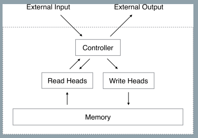
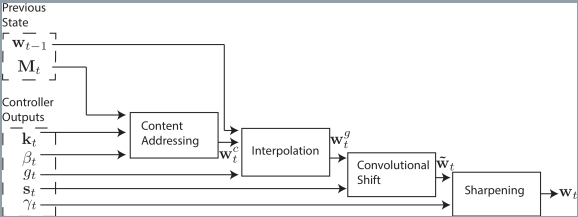
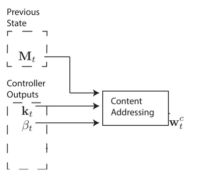
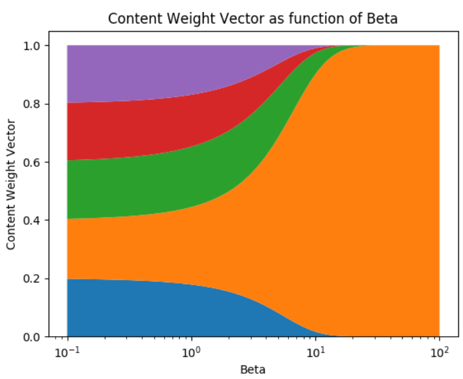
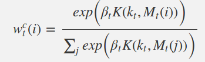
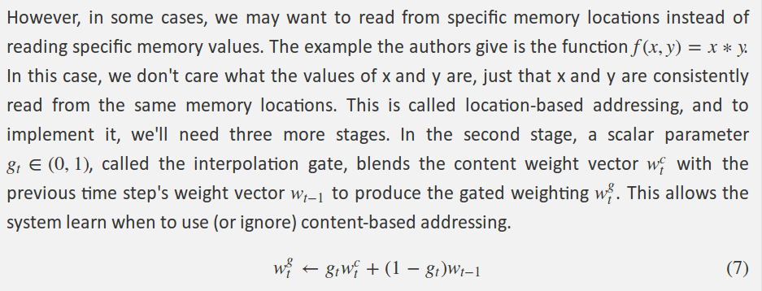
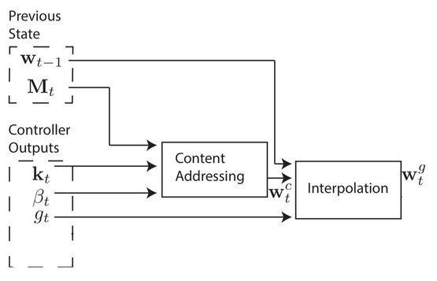
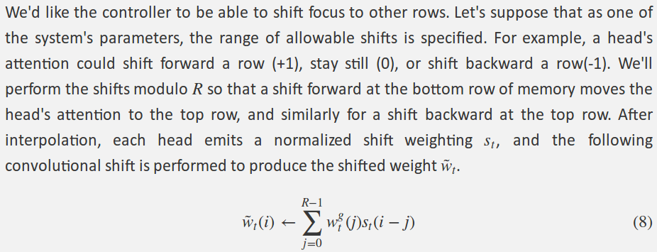
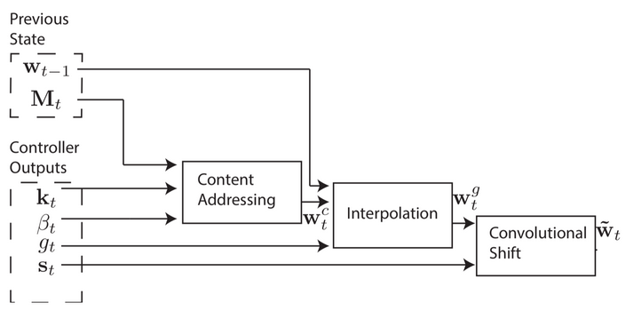
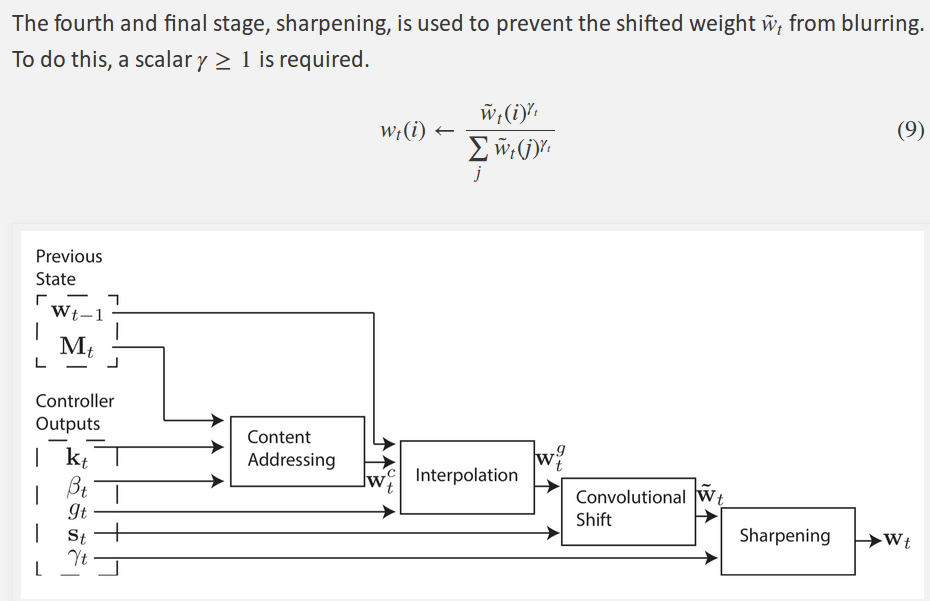

## 2017-7-9

### Neural Turing Machines

###### published: 2014-12

###### author: DeepMind

**Neural Turing Machine**

> A Neural Turning Machine architecture contains two basic components: a neural network *controller* and a *memory bank*, as shown in following figure:

> The NTM's controller interacts with the external world via input and output vectors. Unlike a standard network, it also interacts with a memory matrix using selective read and write operations.

**Reading**
> Let $M_t$ be the contents of the $N * M$ memory matrix at time t, where N is the number of memory locations, and M is the vector size at each location. Let $w_t$ be a vector of weightings over the N locations emitted by a read head at time t. Since all weightings are normalised, the N elements $w_t(i)$ of $w_t$ obey the following constraints:
$$
   \sum_{i}w_{t}(i) = 1,  0 \leq w_t(i) \leq 1
$$

> The length M read vector $r_t$ returned by the head is defined as a convex conbination of the row-vectors $M_t(i)$ in a memory:

$$
r_t \leftarrow \sum_{i} w_t(i) M_t(i)
$$

**Writing**
> Taking inspiration from the input and forget gates in LSTM, we decompose each write into two parts: *an erase followed by an add*.

> Given a weighting $w_t$ emitted by a write head at time t, along with an *erase vector* $e_t$, whose $M$ elements all lie in the range (0, 1), the memory vectors $M_{t-1}(i)$ from the previous time-step are modified as follows:

$$
\hat{M}_t(i) \leftarrow M_{t-1}(i)[1-w_t(i)e_t]
$$

> The elements of a memory location are reset to zero only if both the weighting at the location and the erase element are one; if either the weighting or the erase is zero, the memory is left unchanged.

> Each write head also produces a length M *add vector $a_t$*, which is added to the memory after the erase step has been performed:

$$
M_t(i) \leftarrow \hat{M}_t(i) + w_t(i)a_t
$$

**Addressing Mechanisms**

> Creating these weight vectors to determine where to read and write is tricky, so I'd like to step through the four-stage process. Each stage generates an intermediate weight vector that gets passed to the next stage. The first stage's goal is to generate a weight vector based on how similar each row in memory is to a length-C vector $k_t$ emitted by the controller. I'll refer to this intermediary weight vector $w_t^c$ as the content weight vector. Another parameter, $\beta_t$, will be explained in just a second.

> This content weight vector allows the controller to select values similar to previously seen values, which is called content-based addressing. For each head, the controller produces a key vector $k_t$ that is compared to each row of $M_t$ using a similarity measure. In this paper, the authors use cosine similarity, defined as:

$$
K(u,v) = \frac{u . v}{||v||. ||u||}
$$

> A positive scalar parameter $\beta_t$>0, called the key strength, is used to determine how concentrated the content weight vector should be. **For small values of beta, the weight vector will be diffuse, but for larger values of beta, the weight vector will be concentrated on the most similar row in memory.** To visualize this, if a a key and memory matrix produces a similarity vector [0.1, 0.5, 0.25, 0.1, 0.05], here's how the content weight vector varies as a function of beta.
> The influence of $\beta$ is showing in the figure:

> The content weight vector thus is calculated as follows:

