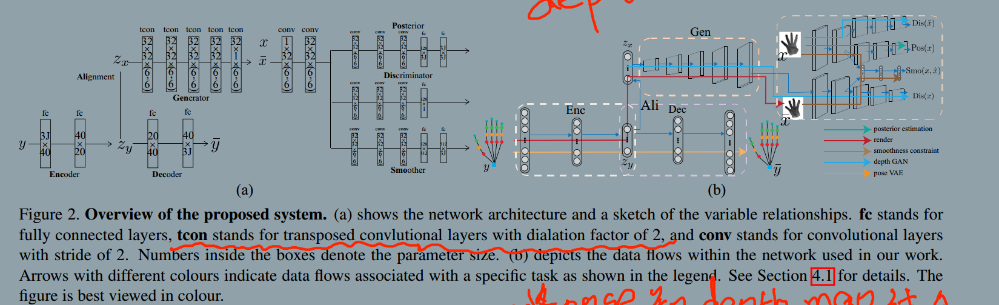
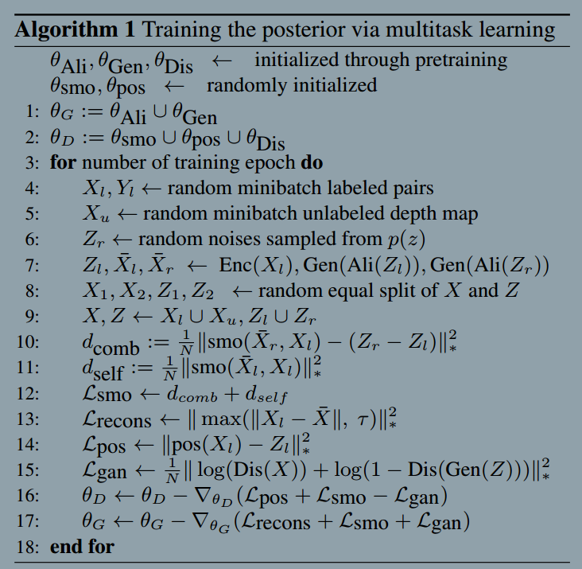

### Crossing Nets: Combining GANs and VAEs with a Shared Latent Space for Hand Pose Estimation
###### published: CVPR 2017
###### authors: ETH(苏黎世联邦理工学院)

> We propose to model the statistical relationships of 3D hand poses and corresponding depth images using two deep generative models with shared latent space.

> Assuming a one-to-one mapping between a pose and a depth map, any given point in the shared latent space can be projected into both a hand pose and a corresponding depth map.

> We address the problem of estimating 3D pose image from single depth images.

> We therefore conclude that the space of realistic hand poses can be represented by a manifold in a lower-dimensional subspace. We further intuit that depth maps of the hand can be similarly encoded in a low-dimensional manifold, and be faithfully reconstructed with an appropriate generator.

> We use the variational autoencoder(VAE) and the generative adversarial network(GAN) for modelling the generation process of hand poses and depth maps respectively.

> One can consider the latent hand pose space and latent depth map space to be shared. Having a shared space is highly beneficial, since a point sampled in either latent space can be expressed both as a 3D pose, via the VAE's decoder, or as a depth map, through the GAN's generator.

> Our core idea is to learn a bi-directional mapping that relates the two latent spaces of hand poses and depth maps and therefore link together the pose encoder network with the generative models for hand poses and depth maps.

> **We learn our discriminator in a multi-task setting.**
> We learn our discriminator in a multi-task setting. First, the discriminator must be able to measure the difference between two given depth maps in the latent space. The second task of the discriminator is the standard GAN task of disambiguating real and systhesized depth maps.The posterior estimation of the hand pose, which is at the core of our method, is the third task for the discriminator.

> Let $o$ represent some observation. We wish to estimate a prior $p(o)$ by modeling the generation process of $o$ by sampling some $z$ from an arbitrary low-dimensional distribution $p(z)$ as $p(o)=\int_{z} p(o|z)p(z)dz$

1. depth map as $x$
2. hand pose as $y$
3. latent variable as $z$
4. latent depth map as $z_x$
5. latent pose as $z_y$
6. synthesized depth map as $\tilde{x}$
7. synthesized pose as $\tilde{y}$

**Pose Variational Autoencoder (Pose VAE)**
$$
z_y \sim Enc(y) = q(z_y | y)
$$
$$
\hat{y} \sim Dec(z_y) = p(y|z_y)
$$
$$
L_{vae} = L_{recons}^{pose} + L_{prior}
$$
$$
L_{recons}^{pose} = -E_{q(z_y|y)}[\log P(y|z_y)]
$$
$$
L_{prior} = D_{KL}(q(z_y|y)||p(z_y))
$$

> We use the VAE to model a prior distribution on hand pose configurations. The encoder-decoder structures allows us to learn a mapping from high dimensional hand poses to a low-dimensional representation while ensuring a high reconstruction accuracy through the decoder.

**Depth Map Generative Adversarial Network (Depth GAN)**
$$
L_{gan} = \log(Dis(x)) + \log(1-Dis(Gen(z_x)))
$$

**Crossing Nets System Overview**
We formulate hand pose estimation as a statistical learning problem: given a corpus of depth maps, we aim to learn a posterior distribution over the corresponding hand poses.
We approach this by combining two generative neural networks, one for pose, and one for depth apperance.
**First, we pre-train each network separately to capture statistics of the individual domains. We then learn a mapping between the two latent spaces $z_x$ and $z_y$. The complete network is then further trained end-to-end for the pose estimation task.**

> We assume that there is a one-to-one mapping between the depth map and the hand pose for the free moving hand. As such, we can arbitrarily choose either the pose or the depth map latent space as the reference shared space and then learn a mapping to the other latent space to link the two generative models together.

**Learning the Shared Latent Space**
> We choose the latent space of hand pose parameter as the reference space and learn a mapping to the depth map latent space. i.e. $z_x = Ali(z_y)$. Note that we do not have training pairs of corresponding $(z_x, z_y)$. What we do have, however, are corresponding pair $(x, y)$, so it is possible instead to compare observed depth images $x$ with synthesized images $\tilde{x}$ that are projected to $z_y$ and then mapped to $z_x$. As such, we introduce a proxy loss $L_{recons}$, based on the reconstruction error of the rendered depth map given a latent input $z_{y}^{i} = Enc(y^i)$ which is mapped to the GAN latent space:
$$
L_{recons} = \frac{1}{N} \sum_{i}^{N} \max(||x^i - Gen(Ali(z_y^i))||^2, \tau)
$$

We model Ali(.) as a single fully connected neuron with a tanh activation. The forward pass corresponds to the purple route.

**Since both the pose VAE and the depth GAN are able to learn low-dimensional representations(our $z_x$ and $z_y$ are both 23 dimensions reprectively). we are able to fit the alignment and generate relistic samples with very few labeled $(x,y)$ pairs.**

**Note the Ali(.) is implicitly learning a mapping from a normal distribution $z_y$ to a uniform distribution $z_x$.**

**Learning the posterior of shared latent variable**
**Although it is theoretically sufficient to use only $(X_l, Y_l)$ pairs for learning the posterior, one does not fully exploit the learned priors from the depth GAN. To allow the posterior estimate to benefit from also synthesized and unlabeled samples and therefore increase generalization power, we add two more task, i.e. a smoothness task and a GAN disambiguation task.**

**To encourage the generator to synthesize more accurate and relistic samples, parameters $\theta_Ali$ and $\theta_Gap$ of the composite generation function Gen(Ali(.)) are updated together with the aforementioned multitasks.**

**We use discriminator to indicate the multitask learning as a whole, taking depth maps as input. In each iteration, both the generator and the discriminator are updated jointly. The discriminator is updated with labeled, unlabeled and synthesized samples; at the same time, the generatior is updated through backpropagated gradients from discriminator. We define the joint generator and discriminator loss as :**

$$
L_G = L_{recons} + L_{smo} - L(gan)
$$
$$
L_D = L_{pos} + L_{smo} + L_{gan}
$$

**Smoothness task**
To encourage the underlying latent space to be smooth, we define a $L_{smo}$ for both the generator and the discriminator. Given two depth maps $x_1, x_2$ and their corresponding underlying latent variables $z_1, z_2$, the smoothness $smo(x_1, x_2)$ task takes $x_1$ and $x_2$ as input and estimates the corresponding latent variable difference $z_1 - z_2$. The estimated difference is then compared to the actual difference. To make $L_smo$ regularize both discriminator and generator, we substitute one of the latent observation pairs with random noise $z_r$ and the corresponding synthesized image $\hat{x}_r$, as indicated by $d_{comb}$ in the following eq. At the same time, we want the projected $z_l$ of the labeled sample to synthesize into an image as close as possible to the original so we add the term $d_self$, resulting in the following smoothness loss:
$$
L_{smo} = d_{comb} + d_{self}
        = \frac{1}{N}||smo(\hat{X}_r, X_l) - (Z_r - Z_l)||_*^2
        + \frac{1}{N}||smo(\hat(X)_l, X_l)||_*^2
$$
$X_l$ is a set of labeled depth maps, $Z_l=Enc(Y_l)$ is their corresponding latent variable and $\hat{X}=Gen(Ali(Z_l))$ the depth maps reconstructed through the generator. $\hat{X}_l$ is also compared to the depth maps $\hat{X}_r=Gen(Ali(Z_r))$, synthesized from a set of random noise vectors $Z_r$ in the latent space.

###两个重要思想:
1. **为了达到某种训练目的,可以通过添加一个额外的网络来调整之前网络的参数,相当于给之前的网络添加了额外的约束.**
2. **smo的作用是保证特征空间的一致性.由于图像是某种隐特征空间的映射,所以,图像和特征空间之间是具有一定的一致性,在训练过程中尽量不要破坏这种一致性,所以添加这个smo的约束,来保证特征空间的一致性.**

**GAN task**
Although disambiguating real from synthetic samples is not directly linked to posterior estimation, it has been shown in several previous works having such a loss encourages the hidden activations of the discriminator to learn, as the name implies, inherently discriminative features without additional supervision.
$$
L_{gan} = \frac{1}{N}||\log(Dis(X))+\log(1-Dis(Gen(Z)))||_*^2
$$

**Posterior task**
$$
L_{pos} = \frac{1}{N}||pos(X_l)-Z_l||_*^2
$$

**Multi-task Training**

