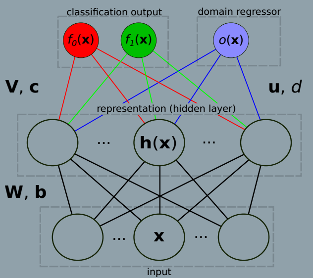
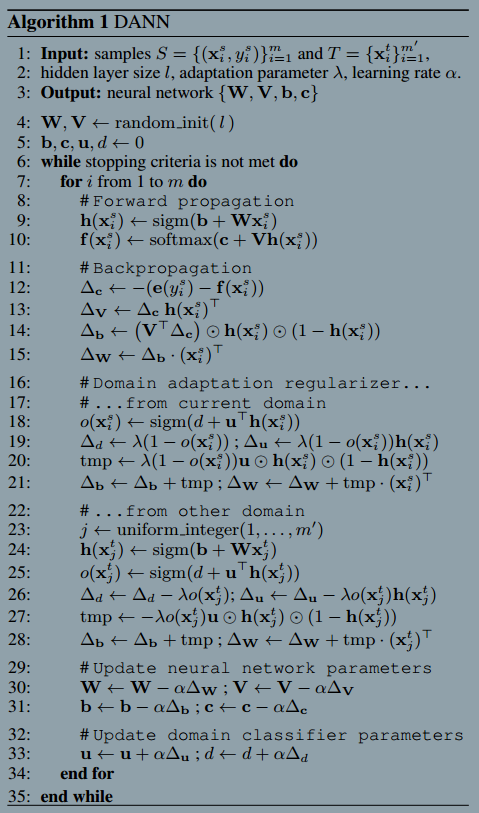

### Domain-Adversarial Neural Networks
###### published: 2015-02
###### authors:  Universite Laval Canada
> We introduce a new representation learning algorithm **suited to the context of domain adaptation, in which data at training and test time come from similar but different distributions. Our algorithm is directly inspired by theory on domain adaptation suggesting that, for effective domain transfer to be achieved, predictions must be made based on a data representation that cannot discriminate between the training(source) and test(target) domains.**

> **A good representation for cross-domain transfer is one for which an algorithm cannot learn to identify the domain of origin of the input observation.**

**Domain Adaptation**
A domain adaptation learning algorithm is then provided with a labeled source sample S drawn i.i.d from $D_S$, and an unlabeled target sample T drawn i.i.d from $D_{T}^{x}$, where $D_{T}^{x}$, where $D_{T}^{x}$ is the marginal distribution of $D_T$ over $x$.
$$
S = {\lbrace (x_{i}^{s}, y_{i}^{s}) \rbrace}_{i=1}^{m}; T={\lbrace x_{i}^{t} \rbrace}_{i=1}^{m'} \sim {(D_{T}^{x})}^{m'}
$$
The goal of the learning algorithm is to build a classifier $\eta : x\rightarrow y$ with a low target risk:
$$
R_{D_{T}}(\eta) = Pr_{(x^t,y^t) \sim D_T}(\eta(x^t) \ne y^t)
$$

**Domain Divergence**
**To tackle the challenging domain adaptation task, many approaches bound the target error by the sum of the source error and a notion of distance between the source and the target distributions. These methods are intuitively justified by a simple assumption: the source risk is expected to be a good indicator of the target risk when both distributions are similar.**

**Definition 1** Given two domain distributions $D_{S}^{x}$ and $D_{T}^{x}$ over x, and a hypothesis class H, the H-divergence between $D_{S}^{x}$ and $D_{T}^{x}$ is
$$
d_H(D_{S}^{x}, D_{T}^{x}) = 2 \sup_{\eta \in H}|Pr_{x^s \sim D_{S}^{x}}[\eta(x^s)=1] - Pr_{x^t \sim D_{T}^{x}}[\eta(x^t)=1]|
$$
That is, the *H-divergence* relies on the capacity of the hypothesis class H to distinguish between examples generated by $D_S^x$ from examples generated by $D_T^x$.

**empirical H-divergence**
$$
d_H(S,T) = 2(1 - \min_{\eta \in H}[\frac{1}{m}\sum_{i=1}^{m}I[\eta(x_i^s)=1] +
\frac{1}{m'}\sum_{i=1}^{m'}I[\eta(x_{i}^{t})=0]])
$$

The *H-divergence* defined a worst classificier $\eta$.

**Theorem 2** Let H be a hypothesis class of VC dimension d. With probability $1-\delta$ over the choice of samples $S \sim (D_S)^m$ and $T \sim (D_T^x)^m$, for every $\eta \in H$:
$$
R_{D_T}(\eta) \le R_S(\eta) + d_H(S,T) + ...
$$
**The empirical source risk**
$$
R_S(\eta) = \frac{1}{m} \sum_{i=1}^{m}I[\eta(x_{i}^{s}) \ne y_{i}^{s}]
$$

**The learning algorithm should minimize a trade-off between the souce risk $R_S(\eta)$ and the empirical H-divergence $d_H(S,T)$. A strategy to control the H-divergence is to find a representation of the examples where both the source and the target domain are as indistinguishable as possible.**

**DANN**

**In DANN, the hidden layer h(.) maps an example(either source or targt) into a representation in which the output layer f(.) accurately classifies the source sample, while the domain regressor o(.) is unable to detect if an example belongs to the source sample or the target sample.**

**Crucially, while the update of the regular parameters follows as usual the opposite direction of the gradient, for the adversarial parameters u, d the step must follow the gradient's direction (since we maximize with respect to them, instead of minimizing).**

The algorithm:

