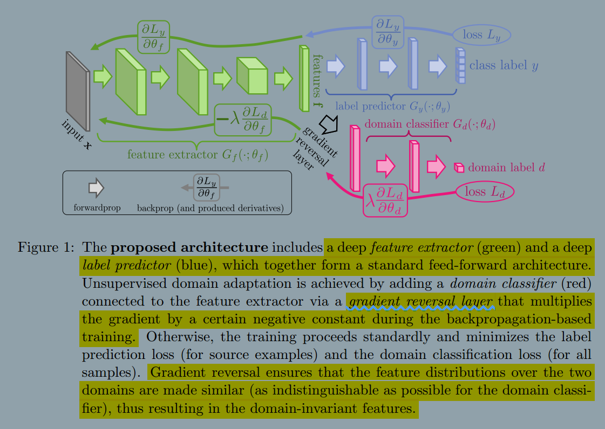

### Domain-Adversarial Training of Neural Networks
###### published: 2016-04 Journal of Machine Learning Research
###### authors:  Universite Laval Canada
**这篇文章是 [Domain-Adversarial Neural Networks](Domain-Adversarial_Neural_Networks.md)的期刊文章**
> We introduce a new representation learning algorithm **suited to the context of domain adaptation, in which data at training and test time come from similar but different distributions. Our algorithm is directly inspired by theory on domain adaptation suggesting that, for effective domain transfer to be achieved, predictions must be made based on a data representation that cannot discriminate between the training(source) and test(target) domains.**

> **A good representation for cross-domain transfer is one for which an algorithm cannot learn to identify the domain of origin of the input observation.**

**Domain Adaptation**
A domain adaptation learning algorithm is then provided with a labeled source sample S drawn i.i.d from $D_S$, and an unlabeled target sample T drawn i.i.d from $D_{T}^{x}$, where $D_{T}^{x}$, where $D_{T}^{x}$ is the marginal distribution of $D_T$ over $x$.
$$
S = {\lbrace (x_{i}^{s}, y_{i}^{s}) \rbrace}_{i=1}^{m}; T={\lbrace x_{i}^{t} \rbrace}_{i=1}^{m'} \sim {(D_{T}^{x})}^{m'}
$$
The goal of the learning algorithm is to build a classifier $\eta : x\rightarrow y$ with a low target risk:
$$
R_{D_{T}}(\eta) = Pr_{(x^t,y^t) \sim D_T}(\eta(x^t) \ne y^t)
$$

**Domain Divergence**
**To tackle the challenging domain adaptation task, many approaches bound the target error by the sum of the source error and a notion of distance between the source and the target distributions. These methods are intuitively justified by a simple assumption: the source risk is expected to be a good indicator of the target risk when both distributions are similar.**

**Definition 1** Given two domain distributions $D_{S}^{x}$ and $D_{T}^{x}$ over x, and a hypothesis class H, the H-divergence between $D_{S}^{x}$ and $D_{T}^{x}$ is
$$
d_H(D_{S}^{x}, D_{T}^{x}) = 2 \sup_{\eta \in H}|Pr_{x^s \sim D_{S}^{x}}[\eta(x^s)=1] - Pr_{x^t \sim D_{T}^{x}}[\eta(x^t)=1]|
$$
That is, the *H-divergence* relies on the capacity of the hypothesis class H to distinguish between examples generated by $D_S^x$ from examples generated by $D_T^x$.

**empirical H-divergence**
$$
d_H(S,T) = 2(1 - \min_{\eta \in H}[\frac{1}{m}\sum_{i=1}^{m}I[\eta(x_i^s)=1] +
\frac{1}{m'}\sum_{i=1}^{m'}I[\eta(x_{i}^{t})=0]])
$$

**Theorem 2** Let H be a hypothesis class of VC dimension d. With probability $1-\delta$ over the choice of samples $S \sim (D_S)^m$ and $T \sim (D_T^x)^m$, for every $\eta \in H$:
$$
R_{D_T}(\eta) \le R_S(\eta) + d_H(S,T) + ...
$$
**The empirical source risk**
$$
R_S(\eta) = \frac{1}{m} \sum_{i=1}^{m}I[\eta(x_{i}^{s}) \ne y_{i}^{s}]
$$

**The learning algorithm should minimize a trade-off between the souce risk $R_S(\eta)$ and the empirical H-divergence $d_H(S,T)$. A strategy to control the H-divergence is to find a representation of the examples where both the source and the target domain are as indistinguishable as possible.**

### The different part
**DANN**
**To learn a model that can generalize well from one domain to another, we ensure that the internal representation of the neural network contains no discriminative information about the origin of the input(source or target), while preserving a low risk on the source(labeled) examples.**

The Objective function:
$$
\min_{W,b,V,c}[\frac{1}{n}\sum_{i=1}^{n}L_{y}^{i}(W,b,V,c)+\lambda R(W,b)]
$$

> The heart of our approach is to design a domain regularizer directly derived from the H-divergence Definition. To this end, we view the output of the hidden layer $G_f(.)$ as the internal representation of the neural newwork.

$$
S(G_f) = \lbrace G_f(x)|x \in S \rbrace
$$
$$
T(G_f) = \lbrace G_f(x)|x \in T \rbrace
$$

The empirical H-divergence of a symmetric hypothesis class H between samples $S(G_f)$ and $T(G_f)$ is given by
$$
\hat{d}_H(S(G_f),T(G_f)) = 2(1-\min_{\eta \in H}[\frac{1}{n}\sum_{i=1}^{n}I[\eta(G_f(x_i))=0]+\frac{1}{n'}\sum_{i=n+1}^{N}I[\eta(G_f(x_i))=1]])
$$

$$
G_d(G_f(x);u,z) = sigm(u^TG_f(x) + z)
$$
The function $G_d(.)$ is a **domain regressor**.

We define its loss by:
$$
L_d(G_d(G_f(x_i)),d_i) = d_i \log{\frac{1}{G_d(G_f(x_i))}} +(1-d_i)\log{\frac{1}{1-G_d(G_f(x_i))}}
$$
where $d_i$ denotes the binary variable(domain label) for the i-th example, which indicates whether $x_i$ come from the source distribution ($x_i\sim D_S^X$ if $d_i=0$) or from the target distribution ($x_i \sim D_T^X$ if $d_i=1$).
$$
R(W,b) = \max_{u,z}[-\frac{1}{n}\sum_{i=1}^{n}L_d^i(W,b,u,z)-\frac{1}{n'}L_d^i(W,b,u,z)]
$$
where $L_d^i(W,b,u,z)=L_d(G_d(G_f(x_i;W,b);u,z),d_i)$
**最大化R(W,b)是为了使分类器能把source domain和target domain分的效果最好**

The complete optimization of objctive as follows:
$$
E(W,V,b,c,u,z) = \frac{1}{n}\sum_{i=1}^{n}L_{y}^{i}(W,b,V,c) - \lambda (\frac{1}{n}\sum_{i=1}^{n}L_d^i(W,b,u,z)+\frac{1}{n'}L_d^i(W,b,u,z))
$$

$$
(\hat{W},\hat{V},\hat{b},\hat{c}) = argmin_{W,V,b,c}E(W,V,b,c,\hat{u},\hat{z})
$$
$$
(\hat{u},\hat{z})=argmax_{u,z}E(\hat{W},\hat{V},\hat{b},\hat{c},u,z)
$$

**Generalization to Arbitrary Architectures**
The prediction loss and the domain loss respectively by:
$$
L_y^i(\theta_f,\theta_y) = L_y(G_y(G_f(x_i;\theta_f);\theta_y),y_i)
$$
$$
L_d^i(\theta_f,\theta_d) = L_d(G_d(G_f(x_i;\theta_f);\theta_d),d_i)
$$
Training DANN then parallels the single layer case and consists in optimizing:
$$
E(\theta_f, \theta_y,\theta_d) = \frac{1}{n}\sum_{y}^{i}(\theta_f,\theta_y) - \lambda(\frac{1}{n}\sum_{i=1}^{n}L_d^i(\theta_f,\theta_d) + \frac{1}{n'}\sum_{i=n+1}^{N}L_d^i(\theta_f,\theta_d))
$$
by finding the saddle point $\hat{\theta}_f, \hat{\theta}_y, \hat{\theta}_d$ such that
$$
(\hat{\theta}_f, \hat{\theta}_y) = argmin_{\theta_f,\theta_y}E(\theta_f,\theta_y,\hat{\theta}_d)
$$
$$
\hat{\theta}_d = argmax_{\theta_d}E(\hat{\theta}_f,\hat{\theta}_y,\theta_d)
$$

A saddle point can be found as a stationary point of the following gradient updates:
$$
\theta_f \leftarrow \theta_f - \mu(\frac{\partial{L_y^i}}{\partial{\theta_f}} - \lambda\frac{\partial{L_d^i}}{\partial{\theta_f}})
$$

$$
\theta_y \leftarrow \theta_y - \mu\frac{\partial{L_y^i}}{\partial{\theta_y}}
$$

$$
\theta_d \leftarrow \theta_d - \mu \lambda \frac{\partial{L_d^i}}{\partial{\theta_d}}
$$

**The only difference is that in above, the gradients from the class and domain predictors are subtracted, instead of being summed(the difference is important, as otherwise SGD would try to make features dissimilar across domains in order to minimize the domain classification loss).**

**Gradient Reversal layer (GRL)**
$$
R(x) = x
$$
$$
\frac{dR}{dx} = -I
$$

$$
\hat{E}(\theta_f,\theta_y,\theta_d) = \frac{1}{n}\sum_{i=1}^{n}L_y(G_y(G_f(x_i;\theta_f);\theta_y),y_i) - \lambda(\frac{1}{n}\sum_{i=1}^{n}L_d(G_d(R(G_f(x_i;\theta_f));\theta_d)d_i)+\frac{1}{n'}\sum_{i=n+1}^{N}L_d(G_d(R(G_f(x_i;\theta_f));\theta_d),d_i))
$$

The total architecture:

