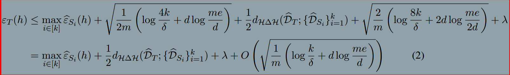
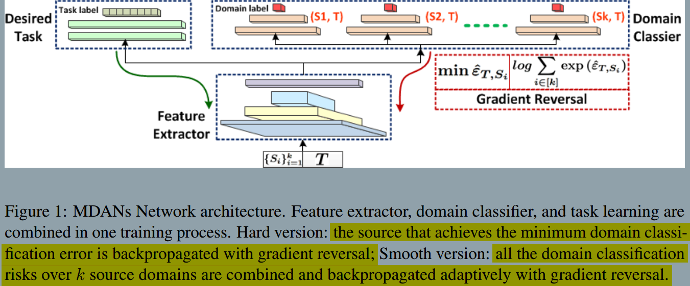
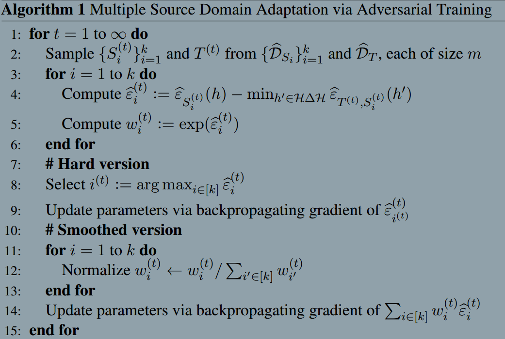

### Multiple Source Domain Adaptation with Adversarial Training of Neural Networks
###### published: 2017-02
###### authors:  CMU

> We propose a new generalization bound for domain adaptation when there are multiple source domains with labeled instances and one target domain with unlabeled instances.
> Compared with existing bounds, the new bound does not require expert knowledge about the target distribution.

**Domain adaptation focuses on such problems by establishing knowledge transfer from a labeled source domain to an unlabeled target domain, and by exploring domain-invariant structures and representations to bridge the gap.**

> The first term measuers the worst case accuracy of hypothesis h on the k source domains, and the second term measures the discrepancy between the target domain and the k source domains. For domain adaptation to succeed in the multiple sources setting, we have to expect these two terms to be small: we pick our hypothesis h based on its source training errors, and it will generalize only if the discrepancy bewteen sources and target is small. The third term $\lambda$ is the optimal error we can hope to achieve.

> It is also worth pointing out that these four terms appearing in the generalization bound also capture the tradeoff between using a rich hypothesis class H and a limited one as we discussed above: when using a richer hypothesis class, the first and the third terms in the bound will decrease, while the value of the second term will increase; on the other hand, choosing a limited hypothesis class can decrease the value of the second term, but we may incur additional source training errors and a large λ due to the simplicity of H.

> Once we fix our hypothesis class H, the last two terms in the generalization bound will be fixed; hence we can only hope to minimize the bound by minimizing the first two term.

