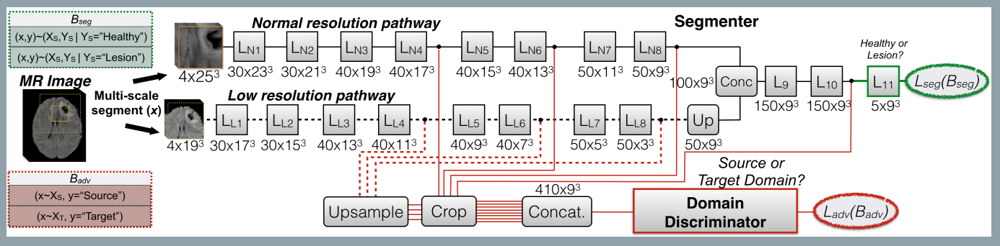

### Unsupervised domain adaptation in brain lesion segmentation with adversarial networks
###### published:2016-12
###### authors: Imperial College London, Cambridge University
> The performance of these systems often degrades when they are applied on new data that differ from the training data, for example, due to variations in imaging protocols.

> We learn domain-invariant features by learning to counter an adversarial network, which attempts to classify the domain of the input data by observing the activations of the segmentation network.

> These methods often under-perform or fail if the testing data come from a different **target domain** $D_T=(X_T,P(X_T))$, with $X_T!=X_S$ and/or $P(X_T)!=P(X_S)$. This is because the optimal predictive function for $D_T$ may differ from **source domain**, and so the learnt $f_S(.)$ will not perform well on $D_T$.

> **Transfer learning investigates development of predictive models by leveraging knowledge from potentially different but realted domains and tasks.**

> **Domain adaptation is the subclass of TL that assumes $Y_S=Y_T$ and only the domain differ. **

> **Unsupervised domain adaptation assume the availability of a labeled database $S=(X_S, Y_S)$ from source domain $D_S$, along with an unlabeled dataset $T=(X_T)$ from a different but related target domain $D_T$.**

The main contribution of this paper is that it proposed a network structure which combined segmentation and domain adaptation.
The main domain adaptation method this paper used is to force the source domain and target domain to generate the same feature maps, which is quite like [CoGAN](Coupled_Generative_Adversarial_Networks.md),[FCN_GAN](FCNs_in_the_Wild_Pixel-level_Adversarial_and_Constraint-based_Adaptation.md).
The loss function of this paper is :
$$
L_{segAdv}(\theta_{seg}) = L_{seg}(\theta_{seg})-\alpha L_{adv}(\theta_{seg})
$$
> We aim at adapting the representation $h_a(.)$ to become invariant to variations between $S$ and $T$. We expose the accuracy of the domain-discriminator to the segmenter and let it alter its parameters such that its FMs that comprise $h_a(.)$ do not contain cues about the input domain.
