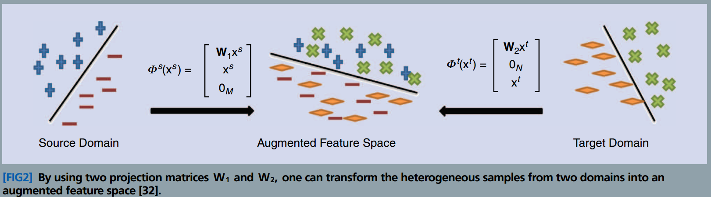
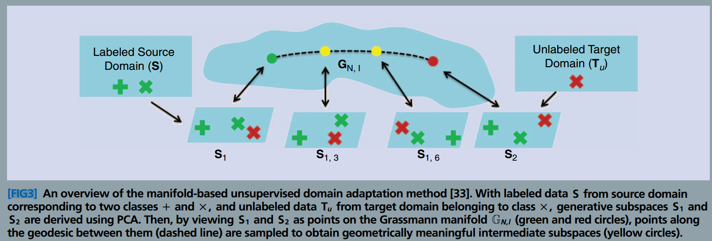
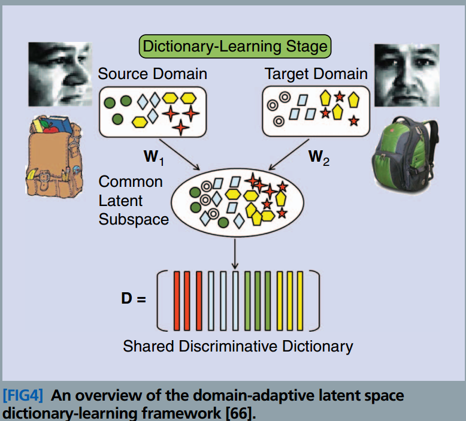
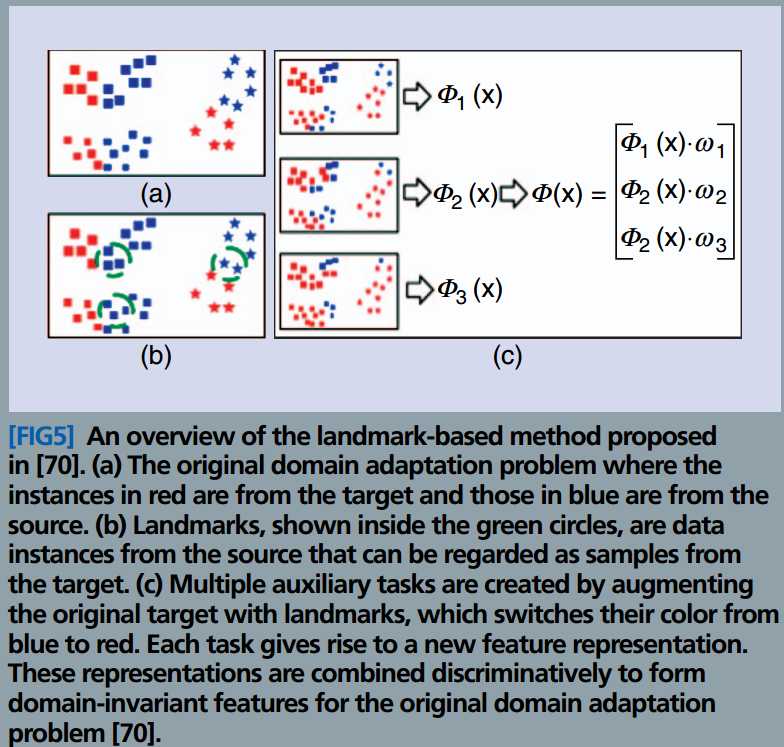
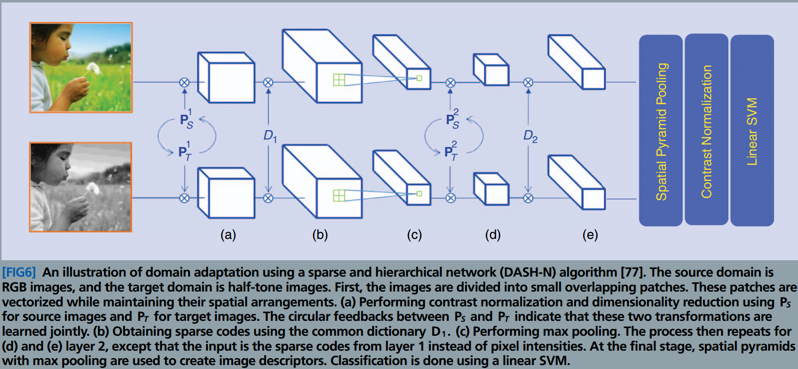

### Visual Domain Adaptation A survey of recent advances
###### published: 2015-05 IEEE signal processing magazine
###### authors:  Vishal M. Patel

**Convariate Shift**
Given an observation, the conditional distributions of Y are the same in the source and the target domains, but the marginal distributions of X differ in the two domains. In other words, $P_t(Y|X=x)=P_s(Y|X=x)$ for all $x \in X$, but $P_t(X)\ne P_s(X)$. This resulting difference between the two domains is known as **convariate shift** or **sample selection bias**.

**Class Imbalance**
Another special case of the domain adaptation formulation assumes that $P_t(X|Y=y)=P_s(X|Y=y)$ for all $y \in Y$, but $P_t(Y) \ne P_s(Y)$. This difference is often known as **class imbalance**.

**Transfer Learning**
The joint probability of each task $\lbrace P(X, Y_i) \rbrace_{i=1}^L$ is different, but there is only a single distribution $P(X)$ of the observation. When learning the class conditional models $\lbrace P(Y_i|X, \theta_i)\rbrace_{i=1}^L$ for L tasks, it is assumed that the model parameters of the individual tasks are drawn from a common prior distribution $P_{\Theta}(\theta)$.

**SEMISUPERVISED LEARNING**

**SELF_TAUGHT LEARNING**

**VISUAL DOMAIN ADAPTATION APPROACHES**

**FEATURE AUGMENTATION-BASED APPROACHES**

**Feature Transformation-based approaches**
**Parameter Adaptation Methods**
**Dictionary-Based Approaches**

**Domain Resampling**

**Other Methods**

