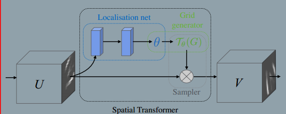
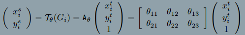
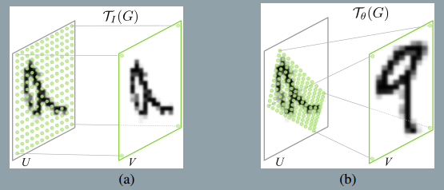
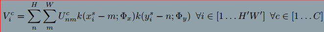
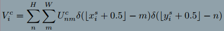

## 2017-7-9
### Spatial Transformer Networks
###### published: 2016-2
###### author: DeepMind

> In this work we introduce a new learnable module, the Spatial Transformer, which explicitly allows the spatial manipulation of data within the network.

> **A desirable property of a system which is able to reason about images is to disentangle object pose and part deformation from texture and shape.**

**Spatial Transformers**
> The spatial transformer mechanism is split into three parts. First a *localisation network* takes the input feature map, and through a number of hidden layers outputs the parameters of the spatial transformation that should be applied to the feature map - this gives a transformation conditional on the iput. Then, the predicted transformation parameters are used to create a *sampling grid*, which is a set of points where the input map should be sampled to produce the transformed output. This is done by the *grid generator*. Finally, the feature map and the sampling grid are taken as inputs to the *sampler*, producing the output map sampled from the input at the grid points.

**Localisation Network**
> The localisation network takes the input feature map $U$ and outputs $\theta$. The size of $\theta$ can vary depending on the transformation type that is parameterised.

**Parameterised Sampling Grid**
> To perform a warping of the input feature map, each output pixel is computed by applying a sampling kernel centered at a particular location in the input feature map, the output pixels are defined to lie on a regular grid $G={G_i}$ of pixels $G_i = (x_i^t, y_i^t)$ forming an output feature map $V \in R^{H'* W' *C'}$.

You can caculate the sampling locations in source image by the formulate $T_{\theta}(G_i)$. The transform allows croping, translation, rotation, scale, and skew to be applied to the input feature map, and requires only 6 parameters to be produced by the localisation network.
An example:

**Differentiable Image Sampling**
> To perform a spatial transormation of the input feature map, a sampler must take the set of sampling points $T_{\theta}(G)$, along with the input feature map $U$ and produce the sampled output feature map $V$.

> In theory, any sampling kernel can be used, as long as sub-gradients can be defined with respect $x_i^s$ and $y_i^s$. For example, using the integer sampling kernel reduces to :

**Spatial Transformer Networks**
> The knowledge of how to transform each training sample is compressed and cached in the weights of the localisation network during training.

> It is also possible to use spatial transformers to downsample or over sample a feature map, as one can define the output dimensions $H'$ and $W'$ to be different to the input dimensions $H$ and $W$.
