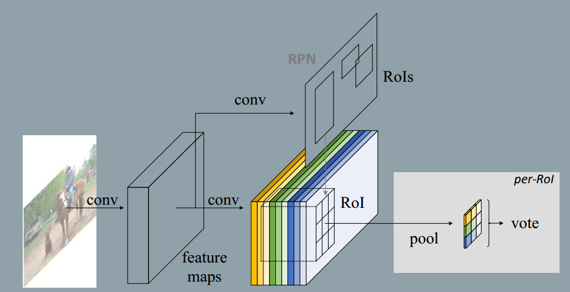
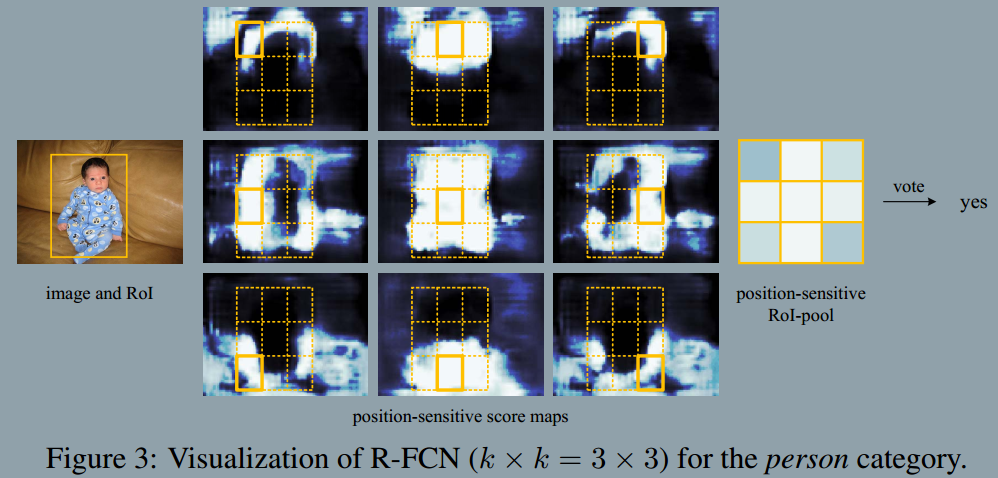
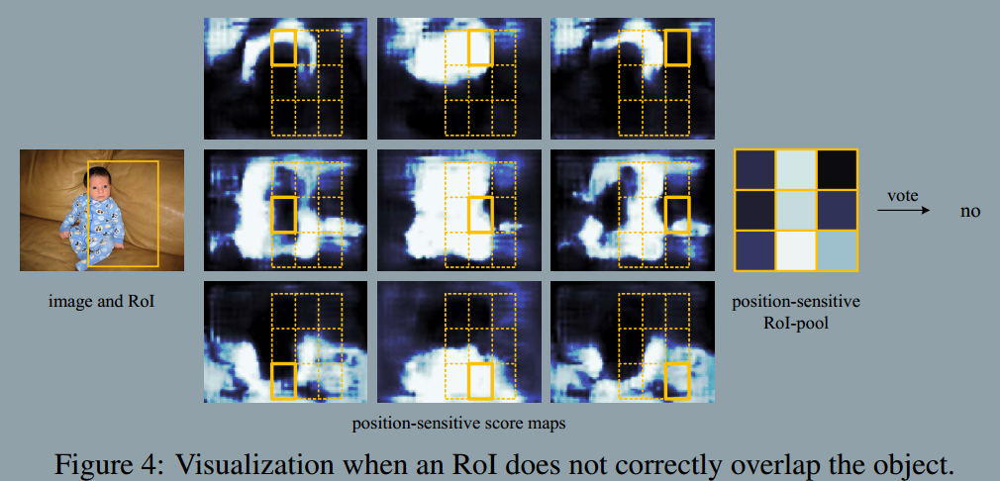

## 2017-7-9
### R-FCN: Object Detection via Region-based Fully Convolutional Networks
###### published: NIPS 2016
###### author: MSAR Jifeng Dai
> However as empirically investigated in this work, this naive solution turns out to have considerably *inferior detection accuracy* that does not match the network's *superior classification accuracy*.

> To remedy this issue, in the ResNet paper the ROI pooling layer of the Faster R-CNN detector is *unnaturally* inserted between two sets of convolutional layers --- this creates a deeper RoI-wise subnetwork that improves accuracy, at the cost of lower speed due to the unshared per-RoI computation.

**We argue that the aforementioned unnatural design is caused by a dilemma of increasing translation *invariance* for image classification vs. respecting translation *variance* for object detection.**

The key idea of R-FCN for object detection as this fingure:

> We hypothesize that deeper convolutional layers in an image classification network are less sensitive to translation. To address this dilemma, the ResNet paper's detection pipeline inserts the Roi pooling layer into convolutions---this *region-specific* operation breaks down translation invariance, and the post-RoI convolutional layers are no longer translation-invariant when evaluated across different regions. However, this design sacrifices training and testing efficiency since it introduces a considerably number of region-wise layers.

The main architecture of R-FCN is:

1. A RPN layer which is the same as Faster-RCNN. This layer proposal many rois, which is the potential object location.
2. A R-FCN layer which contains $k^2*(C+1)$ feature maps. This layer and RPN layer share the same convolution layer.
3. **Position-sensitive score maps & Position-sensitive RoI pooling**
> We divide each RoI rectangle into $k*k$ bins by a regulay grid. For an RoI rectangle of a size $w*h$, a bin is of a size $ \frac{w}{k}* \frac{h}{k} $. The last convolutional layer is constructed to produce $k^2$ score maps for each category. Inside the (i, j)-th bin $0<=i,j<=k-1$, we define a position-sensitive RoI pooling operation that pools only over the (i,j)-th score map:
$$
r_c(i,j|\Theta) = \sum_{(x,y)\subset{bin(i,j)}}z_{i,j,c}(x+x_0, y+y_0|\Theta)/n
$$
> (x0, y0) denotes the top-left corner of an RoI.

> The $k^2$ position-sensitive scores then vote on the RoI. In this paper we simply vote by averaging the scores, producing a (C+1)-dimensional vector for each RoI.

$$
r_c(\Theta) = \sum_{i,j}r_c(i,j|\Theta)
$$

> The we compute the softmax responses across categories:

$$
s_c(\Theta) = e^{r_c(\Theta)}/\sum_{c'=0}^{C}e^{r_{c^{'}}(\Theta)}
$$

4. Aside from the above $k^2(C+1)-d$ convolutional layer, we append a sibling $4k^2-d$ convolutional layer for bounding box regression. The position-sensitive RoI pooling is performed on this bank of $4k^2$ maps, producing a $4k^2-d$ vector for each RoI. Then is is aggregated into a 4-d vector by average voting.

5. The loss function:
$$
L(s, t_{x, y, w,h})=L_{cls}(s_{c^*}) + \lambda|c^*>0|L_{reg}(t,t^*)
$$

6. It is easy for our method to adopt online hard example mining(OHEM) during training. Assuming N proposals per image, in the forward pass, we evaluate the loss of all N proposals. Then we sort all RoIs(positive and negative) by loss and select B RoIs that have the highest loss. Backpropagation is performed based on the selected examples.

7. We reduce ResNet-101's effective stride from 32 pixels to 16 pixels, increasing the score map resolution. All layers before and on the conv4 stage(stride=16) are unchanged; the stride=2 operations in the first conv5 block is modified to have stride=1, and all convolutional filters on the conv5 stage are modified by the "hole algorithm" to compensate for the reduced stride.

8. For example, the *"top-center-sensitive"* score map exhibits high scores roughly near the top-center position of an object. If a candidate box precisely overlaps with a true object, most of the $k^2$ bins in the RoI are strongly activated, and their voting leads to a high score. On the contrary, if a candidate box does not correctly overlaps with a true object, some of the $k^2$ bins in the RoI are not activated, and the voting score is low.
