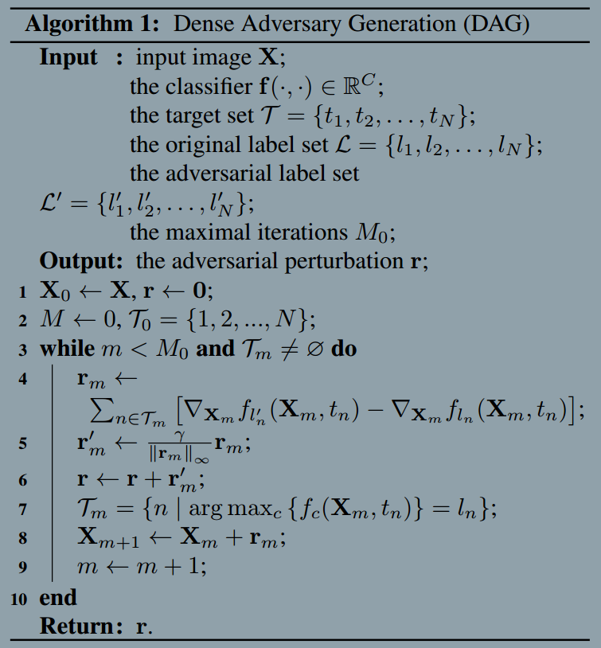

### Adversarial Examples for Semantic Segmentation and Object Detection
###### published: 2017-04
###### authors: Hohns Hopkins University
> It has been well demonstrated that adversarial examples, i.e., natural images with visually imperceptible pertubations added, generally exist for deep networks to fail on image classification. We extend adversarial examples to semantic segmentation and object detection which are much more difficult.

> **Deep networks are often sensitive to small perturbations to the input image. It has shown that adding visually imperceptible perturbations can result in failures for image classification. These perturbed images, often called adversarial examples, are considered to fall on some areas in the large, high-dimensional feature space which are not explored in the training process.**

> Given an image and the recognition targets, DAG generates an adversarial perturbation which is aimed at confusing as many targets as possible.

