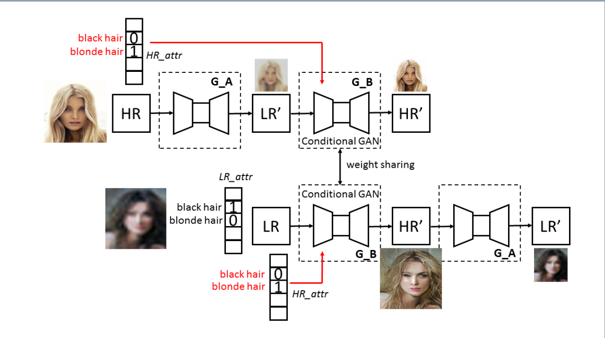
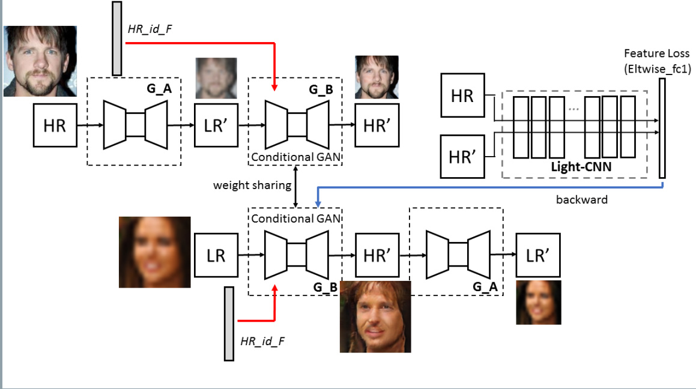

### Conditional CycleGAN for Attribute Guided Face Image Generation
###### published: 2017-05
###### authors: HKUST, Tencent
>  We are interested in realistic face image generation where facial attributes can be fully controlled in the automatic generation process.

> With the proposed attribute-guided approach to face image generation, where the input consists of a low resolution face image and a set of face attributes during inference, we demonstrate the efficacy of our approach on identity-preserving face image super-resolution.

**Cycle GAN**
$$
L(G_{X \rightarrow Y}, G_{Y \rightarrow X}, D_X, D_Y) = L(G_{X \rightarrow Y}, D_Y) + L(G_{Y \rightarrow X}, D_X) + \lambda L_c(G_{X \rightarrow Y}, G_{Y \rightarrow X})
$$

**Attribute Guided Conditional CycleGAN**
> To include conditional constrain into the cycleGAN network, the adversarial loss is modified to include the conditional feature vector as part of the input of the generator and discriminator as:

$$
L(G_{(X,Z) \rightarrow Y}, D_Y) = \min_{\Theta_g} \max_{\Theta_d} {E_{y,z}[\log D_Y(y,z)] + E_{x,z}[\log(1 - D_Y(G_{(X,Z) \rightarrow Y}(x,z),z))]}
$$

**In our implementation, the conditional feature vector is first resized(using replicate) to match the image size of the input image which is downsampled into a low resolution image, with the intensity value of each feature map equal to the value of each column of the feature vector. Hence, for 18-dimensional feature vector, we have 18 homogeneous feature maps after resizing. The resized feature vector is then concatenated with the *conv1* layer of the generator network to propagate the inference of feature vector to the generated images. In the discriminator network, the resized feature vector is also concatenated with the *conv1* layer.**

**Conditional CycleGAN for attribute guided face super-resolution**

*We embed an additional attribute vector, and utilize conditional GAN to train a generator $G_B$ to generate high resolution face image given the low resolution face image and the attribute vector as inputs.*

**Conditional CycleGAN for identity preserving face super-resolution**

*We include additional face verification loss into the training process.*
