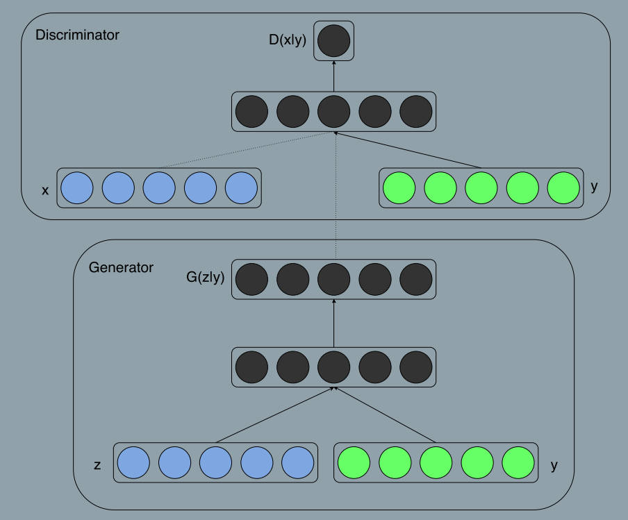

### Conditional Generative Adversarial Nets
###### published: 2014-11
###### authors:Mehdi Mirza
> Generative adversarial nets can be extended to a conditional model if both the generator and the discriminator are conditioned on some extra information **y**. **y** could be any kind of auxiliary information, such as class labels or data from other modalities. We can perform the conditioning by feeding **y** into both the discriminator and generator as additional input layer.

> In the generator the prior input noise $p_z(z)$, and **y** are combined in joint hidden representation, and the adversarial training framework allows for considerable flexibility in how this hidden representation is composed.

> In the discriminator **x** and **y** are presented as inputs and to a discriminative fuction.

$$
\min_{G} \max_{D} V(D,G) = E_{x \sim p_{data}(x)}[\log D(x|y)] + E_{z \sim p_z(z)}[\log(1-D(G(z|y)))]
$$

