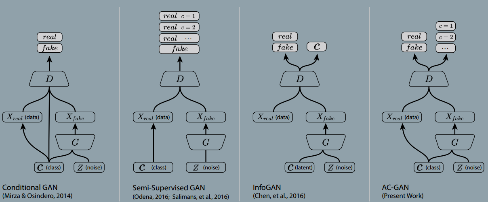

### Conditional Image Synthesis With Auxiliary Classifier GANS
###### published: 2017-01 ICML2017
###### authors: Google Brain
>  **Natural images obey intrinsic invariances and exhibit multi-scale statistical structures that have historically been difficult to quantify.**

> **In this work we demonstrate that adding more structure to the GAN latent space along with a specialized cost function results in higher quality samples.**

> **The basic GAN framework can be augmented using side information. One strategy is to supply both the generator and discriminator with class labels in order to produce class conditional samples. Class conditional synthesis can significantly improve the quality of generated samples. Richer side information such as image captions and bounding box localizations may improve smaple quality further.**

> **Instead of feeding side information to the discriminator, one can task the discriminator with reconstructing side information. This is done by modifying the discriminator to contain an auxiliary decoder network that outputs the class label for the training data, or a subset of the latent variables from which the samples are generated.**

**AC-GAN**
> In the AC-GAN, every generated sample has a corresponding class label, $c \sim p_c$ in addition to the noise $z$. $G$ uses both to generate images $X_{fake} = G(c,z)$. The discriminator gives both a probability distribution over sources and a probability distribution over the class labels, $P(S|X)$, $P(C|X)=D(x)$.

$$
L_S = E[\log P(S=real|X_{real})] + E[\log P(S=fake|X_{fake})]
$$

$$
L_C = E[\log P(C=c|X_{real})] + E[\log P(C=c|X_{fake})]
$$
**D is trained to maximize $L_S+L_C$ while G is trained to maximize $L_C - L_S$.**

