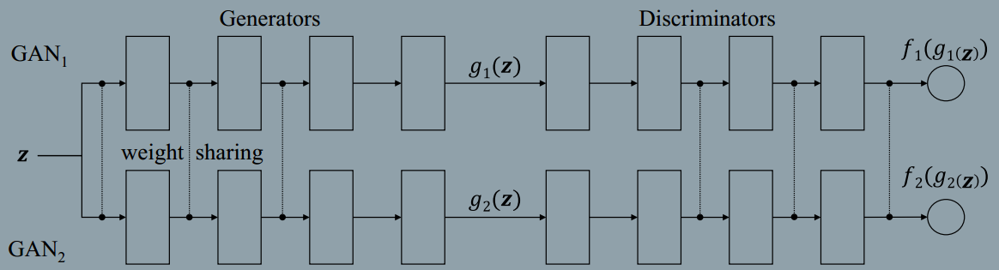

### Coupled Generative Adversarial Networks
###### published: 2016-9  NIPS2016
###### authors:MERL
The main idea of this paper is two different domain images shares the same high level sematic meaning, if the two images contains the same thing.

The CoGAN framework corresponds to a constrained minimax game given by
$$
\max_{g_1,g_2} \min_{f_1, f_2}V(f_1, f_2, g_1, g_2)
$$
, subject to  $\theta_{g1} = \theta_{g2}$, $\theta_{f1}=\theta_{f2}$
$$
V(f_1, f_2, g_1, g_2) = E_{x1 \sim pX_1}[-\log f_1(x_1)]+ E_{z\sim pZ} [-\log(1-f_1(g_1(z)))] + E_{x2\sim px2}[-logf_2(x_2)] + E_{z\sim pz}[-log(1-f_2(g_2(z)))]
$$

> Based on the idea that a pair of corresponding images in two domains share the same high-level concepts, we force the first layers of g1 and g2 to have identical structure and share the weights.

> This constraint forces the high-level semantics to be decoded in the same way in g1 and g2.

> CoGAN learning is based on existence of shared high-level representations in the domians. If such a representation does not exist for the set of domain of interest, it would fail.

**Unsuperviesd Domain Adaptation(UDA)**
> **UDA concerns adapting a classifier trained in one domain to classify samples in a new domain where there is no labeled example in the new domain for re-training the classifier.**
