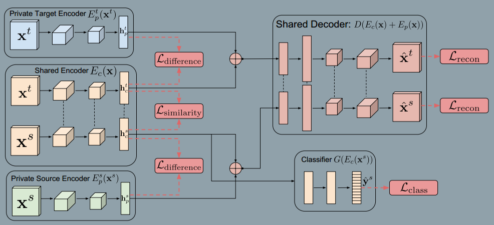

### Domain Separation Networks
###### Google Brain  NIPS 2016
###### 2016
> Existing approaches focus either on mapping representations from one domain to the other, or on learning to extract features that are invariant to the domain from which they were extracted. They ignore the individual characteristics of each domian.

> Inspired by work on private-shared component analysis, we explicitly learn to extract image representations that are partitioned into two subspaces: one component which is private to each domain and one which is shared across domains.

> We define 'low-level' differences in the distributions as those arising due to noise, resolution, illumination and color. 'High-level' differences relate to the number of classes, the types of objects, and geometric variations, such as 3D position and pose.

> Our model, in contrast, introduces the notion of a private subspace for each domain, which captures domain specific properties, such as background and low level image statistics. A shared subspace, enforced through the use of autoencoders and explicit loss functions, captures representations shared by the domains.

**main architecture**

> A private encoder $E_p(x)$(one for each domian) learns to capture domain-specific components of the representation.

> Let $E_c(x;\theta_c)$ be a function parameterized by $\Theta_c$ which maps an image x to a hidden representation $h_c$ representing features that are common or *shared* across domains. Let $E_p(x;\Theta_p)$ be an analogous function which maps an image x to a hidden representation h_p representing features that are private to each domain. Let $D(h;\theta_d)$ be a decoding function mapping a hidden representation h to an image reconstruction x. Finally, $G(h;\theta_g)$ represents a task-specific function, parameterized by $\theta_g$ that maps from hidden representations h to the task-specific predictions y.

**Learning**
$$
L=L_{task}+\alpha L_{recon} + \beta L_{difference} + \gamma L_{similarity}
$$

$$
L_{task} = -\sum_{i=0}^{N_s}y_{i}^{s}.\log \hat{y}_{i}^{s}
$$

$$
L_{recon} = \sum_{i=1}^{N_s}L_{si\_mse}(x_{i}^{s}, \hat{x}_{i}^{s}) + \sum_{i=1}^{N_t}L_{si\_mse}(x_{i}^{t}, \hat{x}_{i}^{t})
$$

$$
L_{si\_mse}(x, \hat{x}) = \frac{1}{k}||x-\hat{x}||_{2}^{2} - \frac{1}{k^2}(x-\hat(x))^2
$$
> The scale-invariant mean squared error penalizes differences between pairs of pixels. This allows the model to learn to reproduce the overall shape of the objects being modeled without expending modeling power on the absolute color or intensity of the inputs.

$$
L_{difference} = ||{H_{c}^{s}}^TH_{p}^{s}||_{F}^{2} + ||{H_{c}^{t}}^TH_{p}^{t}||_{F}^{2}
$$

**Similarity Losses**
**Gradient Reversal Layer(GRL)**
$$
Q(f(u)) = f(u)
$$
$$
\frac{dQ(f(u))}{du} = - \frac{df(u)}{du}
$$
> The domain adversarial similarity loss is used to train a model to produce representations such that a classifier cannot reliably predict the domain of the encoded representation.

> Maximizing such "confusion" is achieved via a Gradient Reversal Layer(GRL) and a domain classifier trained to predict the domain producing the hidden representation. 

> Learning with a GRL is adversarial in that $\theta_z$ is optimized to increase Z's ability to discriminate between encodings of images from the source or target domians, while the reversal of the gradient results in the model parameters $\theta_c$ learning representations from which domain classification accuracy is reduced. Essentially, we *maximize* the binomial cross-entropy for the domian prediction task with respect to $\theta_z$, while minimizing it with respect to $\theta_c$:
>
$$
L_{similarity}^{DANN} = \sum_{i=0}^{N_s+N_t}{d_i \log \hat{d}_i+(1-d_i)\log (1-\hat{d_i})}
$$
