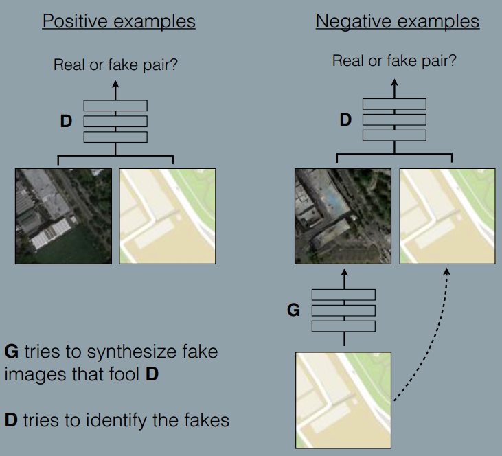

### Image-to-Image Translation with Conditional Adversarial Networks
###### published:2016-11
###### authors:Berkeley AI Research Laboratory(BAIR)
The main contribution of this paper is this paper proposed a new network architecture to implements image-to-image translation using paired training examples. This paper also proposed two kinds of evaluation metrics.

> Image-to-Image translation problems are ofter formulated as per-pixel classification or regression. These formulations treat the output space as "unstructured" in the sense that each output pixel is considered conditionally independent from all others given the imput image. Conditional GANs instead learn a structured loss.
> Euclidean distance is minimized by averaging all plausible ouptuts, which causes blurring.

The idea of pix2pix is illustrated in the following figure:

**Method**
Conditional GANs learn a mapping from observed image x and random noise vector z, to y: $G:\{x, z\}\rightarrow y$.
1. Objective
$$
L_{cGAN}(G, D) = E_{x,y\sim p_{data}(x,y)}[\log D(x,y)] + E_{x\sim p_{data}(x), z\sim p_z(z)}[log(1-D(x, G(x,z)))]
$$
2. anit-blurring
$$
L_{L1}(G) = E_{x,y\sim p_{data}(x,y), z\sim p_z(z)}[\parallel y-G(x,z)\parallel_1]
$$
3. final objectives
$$
  G^* = arg \min_{G}\max_{D}L_{cGAN}(G, D) + \lambda L_{L1}(G)
$$

**Network architecture**
1. **G NetWork** using skips, the network architectures is like U-net
2. **D NetWork** using PatchGAN
