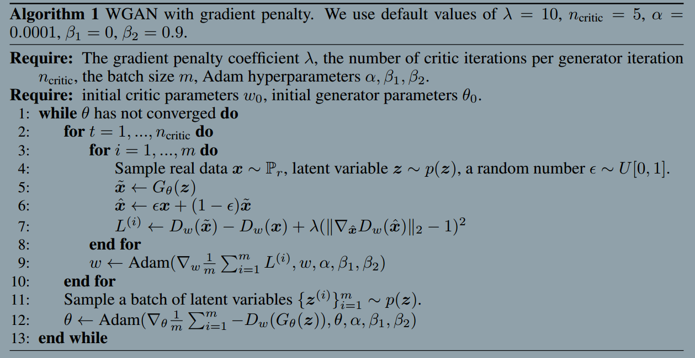

### Improved Training of Wasserstein GANs
###### published: 2017-05
###### authors: Montreal Institute for Learning Algorithms
> We find that these problems are often due to the use of **weight clipping** in WGAN to enforce a Lipschitz constraint on the critic, which can lead to pathological behavior.

**Gradient penalty**

$$
L = E_{x \sim p_g}[D(x)] - E_{x \sim p_r}[D(x)] + \lambda E_{x \sim P_x}[(\nabla_x||D(x)||_2 - 1)^2]
$$

