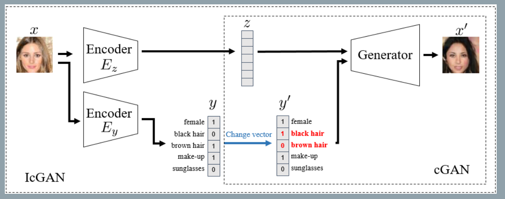
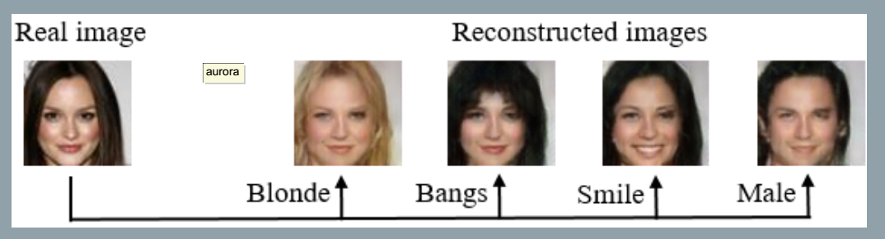

### Invertible Conditional GANs for image editing
###### published: 2016-11 NIPS 2016
###### authors: Computer Vision Center Barcelona, Spain
> cGANs, where the introduction of external information allows to determine specific representations of the generated images. In this work, we evaluate encoders to inverse the mapping of a cGAN, ie., mapping a real image into a latent space and a conditional representation.

**Contributions**
1. Proposing IcGANs, composed of two crucial parts: an encoder and a cGAN.
2. Introducing an encoder in the conditional GAN frame work to compress a real image x into a latent representation z and conditional vector y.

> This inversion would allow us to have a latent representation z from a real image x and, then, we would be able to explore the latent space by interpolating or adding variations on it, which would result in variations on the generated image $x$.

Generator:
$$
x = G(z, y)
$$
Inverted mapping:
$$
(z, y) = E(x)
$$

> Our approach consists of training an encoder E once the cGAN has been trained. The encoder E is composed of two sub-encoders:$E_z$, which encodeers an image to z, and $E_y$, which encoders an image to y.

Encoder:
$$
L_{ez} = E_{z \sim p_z, y \sim p_y}||z-E_z(G(z, y))||_{2}^{2}
$$
$$
L_{ey} = E_{x, y \sim p_{data}}||y-E_y(x)||_{2}^{2}
$$

**Conditional position**
> The conditional information vector y are always concatenated in the filter dimension at the input level in generator. As for the discriminator, different authors insert y in different parts of the model. **We expect that the earlier y is positioned in the model the better since the model is allowed to have more learning interactions with y**.

**Conditional sampling**
> There are two types of conditional information, y and y'. The first one is trivially sampled from $(x,y) \sim p_{data}$ and is used for training the discriminator D(x,y) with a real image x and its associated label y. The second one is sampled from $y' \sim p_y$ and serves as input to the generator $G(z, y')$ along with a latent vector $z \sim p_z$ to generate an image x'. We will directly sample y from $p_data$.

**Model architecture**

