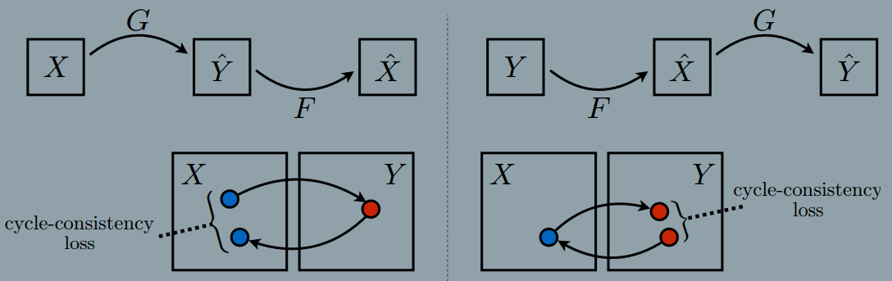
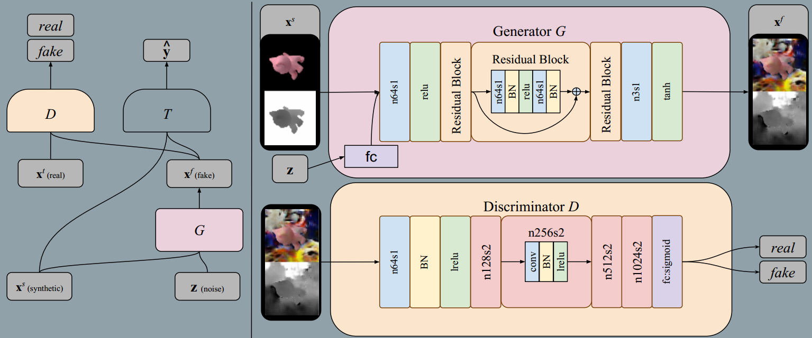
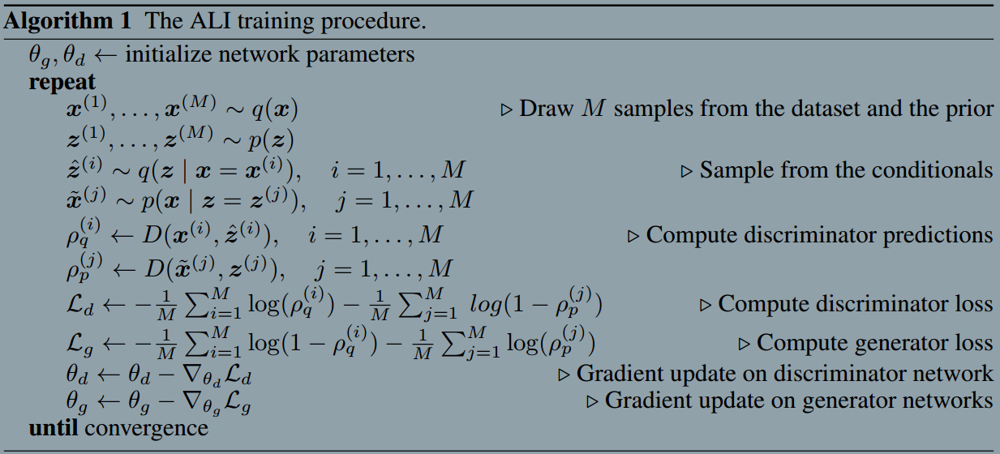
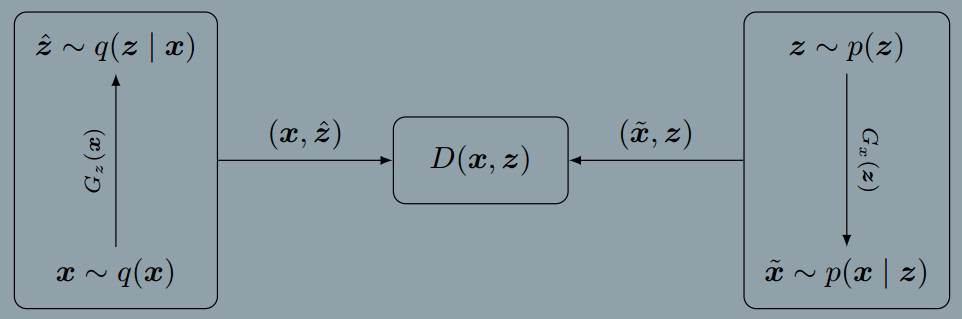
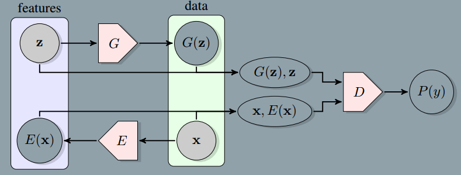
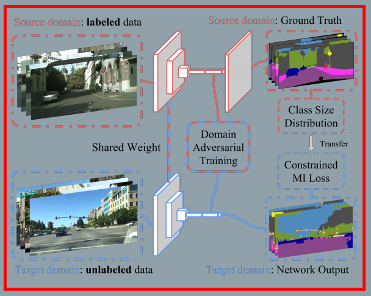

## Towards Principled Methods For Training Generative Adversarial Networks
### Introduction
> Always, $g_\Theta$ is a neural network parameterized by $\Theta$, and the main difference is how $g_\Theta$ is trained

$$
KL(P_r||P_g) = \int P_r(x)log \frac{P_r(x)}{P_g(x)}dx
$$

> This cost function is not symetrical between $P_r$ and $P_g$:
> If $P_r(x) \gt P_g(x)$, then x is a point with higher probability of coming from the data than being a generated sample. This is the core of the phenomenon commonly described as **mode dropping**. It is important to note that when $P_r(x)>0$ but $P_g(x)\rightarrow0$, the integrand inside the KL grows quickly to infinity, meaning that this cost function assigns an extremely high cost to a generator's distribution not covering parts of the data.

> If $P_r(x)<P_g(x)$, then x has low probability of being a data point, but high probability of being generated by our model. This is the case when we see our generator outputting an image that doesn't look real. In this case, when $P_r(x)\rightarrow0$ and $P_g(x)>0$, we see that the value inside the KL goes to 0, meaning that this cost function will **pay extremely low cost for generating fake looking samples**.

$$
JSD(P_r \parallel P_g)=\frac12KL(P_r \parallel P_g) + \frac12KL(P_g\parallel P_A)
$$
$$
L(D^*, g_\Theta) = 2JSD(P_r \parallel P_g) - 2\log2
$$

> We will prove that as the approximation gets better, either we see vanishing gradients or the massively unstable behaviour we ses in practice, depending on which cost function we use.
> **In practice, as the discriminator gets better, the updates to the generator get consistently worse.**

### Sources Of Instability
> The theory tells us that the trained discriminator will have cost at most $2\log2-2JSD(P_r\parallel P_g)$. However, in practice, if we just train D till convergence, its error will go to 0. **The only way this can happen is if the distributions are not continuous, or they have disjoint supports.**
$$
\parallel D \parallel = sup_
$$
> **One possible cause for the distributions not to be continuous is if their supports lie on low dimensional manifolds.**

> **Lemma 1. Let $g: Z \rightarrow X$ be a function composed by affine transformations and pointwise nonlinearities, which can either be rectifiers, leaky rectifiers, or smooth strictly increasing functions (such as the sigmoid, tanh, softplus, etc). Then, $g(Z)$ is contained in a countable union of manifolds of dimension at most dim Z. Therefore, if the dimension of Z is less than the one of X, $g(Z)$ will be a set of measure 0 in X.**

> If two manifolds don't perfectly align, their intersection $L=M \bigcap P$ will be a finite union of manifolds with dimensions strictly lower than both the dimension of M and the one of P.

> These two theorems tell us that there are perfect discriminators which are smooth and constant almost everywhere in M and P. The fact that the discriminator is constant in both manifolds points to the fact that we won’t really be able to learn anything by backproping through it.

### Wasserstein GAN

## 2017-06-13
### Unpaired Image-to-Image Translation using Cycle-Consistent Adversarial Networks
###### published:2017-3
###### authors:Berkeley AI Research Laboratory(BAIR)
The main contribution of this paper is the authr **present an approach for learning to translate an image from a source domain X to a target domain Y in the abesnce of paired examples.**. The goal of this paper is to learn a mapping $G: X\rightarrow Y$ such that the distribution of images from $G(X)$ is indistinguishable from the distribution Y using an adversarial loss. The main idea of this paper is to capture the special characteristics of one image collection and figuring out how these characteristics could be transloated into the other images collection.

The produce is illustrate in the following figure:

> Formulation
> Our goal is to learn mapping functions between two domains X and Y givens training smaples ${x_i}\in X $ and ${y_j}\in Y$. As illustrated in above Figure, our model includes two mapping $G: X\rightarrow Y$ and $F: Y\rightarrow X$. In addition, we introduce two adversarial discriminators $D_x$ and $D_y$, where $D_x$ aims to distinguish between images {x} and translated images {F(y)}; in the same way, $D_y$ aims to discriminate between {y} and {G(x)}.

**Loss Function**
1. Adversarial Loss
$$
L_{GAN}(G, D_Y, X, Y) = E_{y\sim p_{data}(y)}[\log{D_Y(y)}] + E_{x\sim p_{data}(x)}[\log(1-D_Y(G(x)))]
$$
2. Cycle Consistency Loss
$$
  L_{cyc}(G, F) = E_{x\sim p_{data}(x)}[\parallel F(G(x)) - x \parallel_1]+E_{y\sim p_{data}(y)}[\parallel G(F(y))-y \parallel_1]
$$
3. Full Objective
$$
L(G, F, D_x, D_y) = L_{GAN}(G, D_Y, X, Y) + L_{GAN}(F, D_X, Y, X) + \lambda L_{cyc}(G, F)
$$
4. Target
$$
 G^*, F^* = arg\min_{F,G} \max_{D_x, D_y} L(G, F, D_x, D_y)
$$

**Network Architecture**
> **G network** This network contains two stride-2 convolutions, several residual blocks, and two fractionallystrided convolutions with stride 1/2. We use 6 blocks for 128 × 128 images, and 9 blocks for 256×256 and higherresolution training images.
> **D network** we use 70x70 PatchGANs, which try to classify whether 70*70 voerlapping imagepatches are real or fake.

**Training details**
1. For $L_{GAN}$, we replace the negative log likelihood objective be a least square loss.
$$
L_{LSGAN}(G, D_Y, X, Y) = E_{y\sim p_{data}(y)}[(D_Y(y)-1)^2]+E_{x\sim p_{data}(x)}[D_Y(G(x))^2]
$$
2. To reduce model oscillation, We update discriminators $D_x$ and $D_y$ using a history of generated images rather than the ones produced by the latest generative networks. We keep an image buffer that stores the 50 previously generated images.

### Image-to-Image Translation with Conditional Adversarial Networks
###### published:2016-11
###### authors:Berkeley AI Research Laboratory(BAIR)
The main contribution of this paper is this paper proposed a new network architecture to implements image-to-image translation using paired training examples. This paper also proposed two kinds of evaluation metrics.

> Image-to-Image translation problems are ofter formulated as per-pixel classification or regression. These formulations treat the output space as "unstructured" in the sense that each output pixel is considered conditionally independent from all others given the imput image. Conditional GANs instead learn a structured loss.
> Euclidean distance is minimized by averaging all plausible ouptuts, which causes blurring.

The idea of pix2pix is illustrated in the following figure:

**Method**
Conditional GANs learn a mapping from observed image x and random noise vector z, to y: $G:\{x, z\}\rightarrow y$.
1. Objective
$$
L_{cGAN}(G, D) = E_{x,y\sim p_{data}(x,y)}[\log D(x,y)] + E_{x\sim p_{data}(x), z\sim p_z(z)}[log(1-D(x, G(x,z)))]
$$
2. anit-blurring
$$
L_{L1}(G) = E_{x,y\sim p_{data}(x,y), z\sim p_z(z)}[\parallel y-G(x,z)\parallel_1]
$$
3. final objectives
$$
  G^* = arg \min_{G}\max_{D}L_{cGAN}(G, D) + \lambda L_{L1}(G)
$$

**Network architecture**
1. **G NetWork** using skips, the network architectures is like U-net
2. **D NetWork** using PatchGAN

### Coupled Generative Adversarial Networks
###### published: 2016-9  NIPS2016
###### authors:MERL
The main idea of this paper is two different domain images shares the same high level sematic meaning, if the two images contains the same thing.

The CoGAN framework corresponds to a constrained minimax game given by
$$
\max_{g_1,g_2} \min_{f_1, f_2}V(f_1, f_2, g_1, g_2)
$$
, subject to  $\theta_{g1} = \theta_{g2}$, $\theta_{f1}=\theta_{f2}$
$$
V(f_1, f_2, g_1, g_2) = E_{x1} \sim pX_1[-\log f_x(x_1)]+ E_{z\sim pZ} [-\log(1-f_1(g_1(z)))] + E_{x2\sim px2}[-logf_2(x_2)] + E_{z\sim pz}[-log(1-f_2(g_2(z)))]
$$

> Based on the idea that a pair of corresponding images in two domains share the same high-level concepts, we force the first layers of g1 and g2 to have identical struc ture and share the weights.

> This constraint forces the high-level semantics to be decoded in the same way
in g1 and g2.

> CoGAN learning is based on existence of shared high-level representations in the domians. If such a representation does not exist for the set of domain of interest, it would fail.

**Unsuperviesd Domain Adaptation(UDA)**
> **UDA concerns adapting a classifier trained in one domain to classify samples in a new domain where there is no labeled example in the new domain for re-training the classifier.**
## 2017-06-15
### Unsupervised Pixel-Level Domain Adaptation with Generative Adversarial Networks
###### authors: Google Brain
###### published: 2016-12
The main puporses of this paper is to solve the domian adaption problems. This paper using the sourse domian samples to generate target domain samples via Generative Network.

> We would like to transfer knowledge learned from a source domian, for which we have labeled data, to a target domain, for which we have no ground truth labels.

> We employ a generative adversarial objective to encourage G to produce images that are similar to the target domain images. $G(x^s, z; \theta_G)\rightarrow x^f$ maps a source image $x^s$ and a noise vector z to an adapted image $x^f$.

> The discriminator tries to distinguish between 'fake' images $X^f$ produced by the generator, and 'real' images from the target domain $X^t$.

**main formulations**
$$
\min_{\theta_G, \theta_T} \max_{\theta_D} \alpha L_D(D, G) + \beta L_t(G, T) + \gamma L_c(G)
$$
**GAN Loss**
$$
L_d(D, G) = E_{x^t}[\log D(x^t;\theta_D)] + E_{x^s,z}[\log(1-D(G(x^s,z;\Theta_G);\Theta_D))]
$$
**Task Specific Loss**
$$
L_t(G,T) = E_{x^s, y^s, z}[-y^{s^T}\log T(G(x^s,z;\Theta_G);\Theta_T)-y^{s^T}\log T(x^s);\Theta_T]
$$

> During the first stpe, we update the discriminator and task-specific parameters $\theta_D$,$\theta_T$, while keeping the generator parameters $\theta_G fixed$. During the second step we fix $\theta_D, \theta_T$ and update $\theta_G$.

**Content-similarity loss**
$$
L_c(G = E_{x^s,z}[\frac1k||(x^s - G(x^s, z;\Theta_G))m||-\frac{1}{k^2}((x^s-G(x^s,z;\theta_g))^Tm)^2]
$$

## 2017-6-18
### Domain Separation Networks
###### Google Brain  NIPS 2016
###### 2016
> Existing approaches focus either on mapping representations from one domain to the other, or on learning to extract features that are invariant to the domain from which they were extracted. They ignore the individual characteristics of each domian.

> Inspired by work on private-shared component analysis, we explicitly learn to extract image representations that are partitioned into two subspaces: one component which is private to each domain and one which is shared across domains.

> We define 'low-level' differences in the distributions as those arising due to noise, resolution, illumination and color. 'High-level' differences relate to the number of classes, the types of objects, and geometric variations, such as 3D position and pose.

> Our model, in contrast, introduces the notion of a private subspace for each domain, which captures domain specific properties, such as background and low level image statistics. A shared subspace, enforced through the use of autoencoders and explicit loss functions, captures representations shared by the domains.

**main architecture**

> A private encoder $E_p(x)$(one for each domian) learns to capture domain-specific components of the representation.

> Let $E_c(x;\theta_c)$ be a function parameterized by $\Theta_c$ which maps an image x to a hidden representation $h_c$ representing features that are common or *shared* across domains. Let $E_p(x;\Theta_p)$ be an analogous function which maps an image x to a hidden representation h_p representing features that are private to each domain. Let $D(h;\theta_d)$ be a decoding function mapping a hidden representation h to an image reconstruction x. Finally, $G(h;\theta_g)$ represents a task-specific function, parameterized by $\theta_g$ that maps from hidden representations h to the task-specific predictions y.

**Learning**
$$
L=L_{task}+\alpha L_{recon} + \beta L_{difference} + \gamma L_{similarity}
$$

$$
L_{task} = -\sum_{i=0}^{N_s}y_{i}^{s}.\log \hat{y}_{i}^{s}
$$

$$
L_{recon} = \sum_{i=1}^{N_s}L_{si\_mse}(x_{i}^{s}, \hat{x}_{i}^{s}) + \sum_{i=1}^{N_t}L_{si\_mse}(x_{i}^{t}, \hat{x}_{i}^{t})
$$

$$
L_{si\_mse}(x, \hat{x}) = \frac{1}{k}||x-\hat{x}||_{2}^{2} - \frac{1}{k^2}(x-\hat(x))^2
$$
> The scale-invariant mean squared error penalizes differences between pairs of pixels. This allows the model to learn to reproduce the overall shape of the objects being modeled without expending modeling power on the absolute color or intensity of the inputs.

$$
L_{difference} = ||{H_{c}^{s}}^TH_{p}^{s}||_{F}^{2} + ||{H_{c}^{t}}^TH_{p}^{t}||_{F}^{2}
$$

**Similarity Losses**
**Gradient Reversal Layer(GRL)**
$$
Q(f(u)) = f(u)
$$
$$
\frac{dQ(f(u))}{du} = - \frac{df(u)}{du}
$$

> Learning with a GRL is adversarial in that $\theta_z$ is optimized to increase Z's ability to discriminate between encodings of images from the source or target domians, while the reversal of the gradient results in the model parameters $\theta_c$ learning representations from which domain classification accuracy is reduced. Essentially, we *maximize* the binomial cross-entropy for the domian prediction task with respect to $\theta_z$, while minimizing it with respect to $\theta_c$:
>
$$
L_{similarity}^{DANN} = \sum_{i=0}^{N_s+N_t}{d_i \log \hat{d}_i+(1-d_i)\log (1-\hat{d_i})}
$$

## 2017-6-19
### Adversarially Learned Inference
###### authors: Montreal,Stanford,New York
###### published: 2016-12 ICLR-2017

> We introduce the adversarially learned inference model, which jointly learns a generation network and an inference network using an adversarial process. The generation network maps samples from stochastic latent variables to the data space while the inference network maps training examples in data space to the space of latent variables.

> A discriminator is trained to discriminate joint samples of the data and the corresponding latent variable from the encoder(or approximate posterior) from joint samples from the decoder while in opposition, the encoder and the decoder are trained together to fool the discriminator. Not only are we asking the discriminator to distinguish synthetic samples from real data, but we are requiring it to distinguish between two joint distributions over the data space and the latent variables.

* the encoder joint distribution $q(x, z) = q(x)q(z|x)$
* the decoder joint distribution $p(x, z) = p(z)p(x|z)$

> The encoder marginal $q(x)$ is the empirical data distribution and the decoder marginal $p(z)$ is usually defined to be a simple, factorized distribution, such as the standard Normal distribution $p(z)=N(0, I)$.

**ALI's objective is to match the two joint distributions**

> Joint pairs $(x, z)$ are drawn either from $q(x, z)$ or $p(x, z)$, and a discriminator network learns to discriminate between the two, while the encoder and decoder networks are trained to fool the discriminator.

$$
\min_{G} \max_{D} V(D, G) = E_{q(x)}[\log (D(x, G_z(x)))] + E_{p(z)}[\log (1-D(G_x(z),z))]
= \iint q(x)q(z|x)log(D(x, z))dxdz + \iint p(z)p(x|z)\log(1-D(x,z))dxdz
$$

> An attractive property of adversarial approaches is that they do not require that the conditional densities can be computed; they only require that they can be sampled from in a way that allows gradient backpropagation.

> The discriminator is trained to distinguish between samples from the $encoder(x, \hat{z})\sim q(x, z)$ and samples from the decoder $(\hat{x}, z)\sim p(x, z)$. The generator is trained to fool the discriminator, i.e., to generate x, z pairs from $q(x, z)$ or $p(x,z)$ that are indistinguishabel one from another.

**training method**
The generator is trained to maximize:
$$
V'(D,G) = E_{q(x)}[log(1-D(x, G_z(x)))] + E_{p(z)}[log(D(G_x(z), z))]
$$
> However, gradient propagation into the encoder and decoder networks relies on the reparametrization trick, which means that ALI is not directly applicable to either applications with discrete data or to models with discrete latent variables.

### Adversarial Feature Learning
###### authors: berkeley
###### published: 2017-1
The main ideas of this paper is the same as above paper.

> Intuitively, models trained to predict these semantic latent representations given data may serve as useful feature representations for auxiliary problems where semantics are relevant.

> We propose Bidirectional Generative Adversarial Networks(BiGANs) as a means of learning this inverse mapping, and demonstrate that the resulting learned feature representation is useful for auxiliary supervised discrimination tasks, competitive with contemporary approaches to unsupervised and self-supervised feature learning.

> BiGAN includes an *encoder E* which maps data x to lantent representations z. The BiGAN discriminator *D* discriminates not only in data space(x versus G(z)), but jointly in data and lantent space(tuples(x, E(x))) versus (G(z), z), where the latent component is either an encoder output $E(x)$ or a generator input z.

### FCNs in the Wild: Pixel-level Adversarial and Constraint-based Adaptation
###### authors: Stanford Berkeley Princeton
###### data: 2016-12

> FCN models perform well in a supervised setting, but performance can be surprisingly poor under domain shifts that appear mild to a human observer. For example, training on one city and testing on another in a different geographic region and/or weather condition may result in significantly degraded performance due to pixel-level distribution shift.

**This paper introduced the first domain adaptive semantic segmentation method, proposing an unsupervised adversarial approach to pixel prediction problems.**

> Our method consists of both global and category specific adaptation techniques.

> **In this work, we propose the first unsupervised domian adaptation method for transferring semantic segmentation FCNs across image domains. A second contribution of our approach is the combination of global and loacl alignment methods, using global and category specific adaptation techniques that are themselves individually innovative contributions. We align the global statistics of our source and target data using a convolutional domian adversarial training technique, using a novel extension of previous image level classification approaches.**

> Our goal is to learn a semantic segmentation model which is adapted for use on the unlabeled target domian,$T$, with images, $I_T$, but no annotations.

> Global changes may occur between the two domains resulting in a marginal distribution shift of corresponding feature space.
> The second main shift occurs due to category specific parameter chages. This may result from individual categories having specific biases in the two domians.

**The first assumption**
> The source and target domians share the same label space and that the source model achieves performance greater than chance on the target domian.

> We introduce two new semantic segmentation loss objectives, one to minimize the global distribution distance, which operates over both source and target images, $L_{da}(I_S, I_T)$. Another to adapt the category specific parameters using target images and transferring label statistics from the source domian $P_{L_S}$, $L_{mi}(I_T, P_{LS})$. Finally, to ensure that we do not diverge too far from the source solution, which is known to be effective for the final semantic segmentation task, we continue to optimize the standard supervised segmentation objective on the source domian, $L_{seg}(I_S, L_S)$.

$$
L(I_S, L_S, I_T) = L_{seg}(I_S, L_S) + L_{da}(I_S, I_T) + L_{mi}(I_T, P_{L_S})
$$

* Global Domain Alignment
> We seek to minimize the domian shift between representations of the source and target domian. We should comprise an instance within the dense prediction framework, instead, we consider the region corresponding to the natural receptive field of each spatial unit in the final representation layer(*e.g.$f_{c7}$*), as individual instances.

> The second concerning estimating the distance fuction through training a domain classifier to distinguish instances of the source and target domians.
> We then seek to learn a domain classifier to recognize the difference between souce and target regions and use that classifier to guide the distance minimization of the source and target representations.

$$
L_D = -\sum_{I_s\subset S}\sum_{h \subset H} \sum_{w \subset W}\log (p_{\theta_D}(R_{hw}^{S})) - \sum_{I_T\subset T}\sum_{h\subset H}\sum_{w \subset W}\log(1-p_{\theta_D}(R_{hw}^{T}))
$$
**For convenience let us also define the inverse domian loss**
$$
L_{D_{inv}} = -\sum_{I_s\subset S}\sum_{h \subset H} \sum_{w \subset W}\log (1- p_{\theta_D}(R_{hw}^{S})) - \sum_{I_T\subset T}\sum_{h\subset H}\sum_{w \subset W}\log(p_{\theta_D}(R_{hw}^{T}))
$$
$$
\min_{\theta_D} L_D
$$
$$
\min_\theta \frac{1}{2}[L_D + L_{D_{inv}}]
$$
* Category Specific Adaptation
> We consider new constraints which are useful for our pixel-wise unsupervised adaptation problem.**In particular, we begin by computing per image labeling statistics in the source domian, $P_{L_S}$. Specifically, for each source image which contains class c, we compute the percentage of image pixels which have a ground truth label corresponding to this class. We can then compute a histogram over these percentages and denote the lower 10% boundary as, $\alpha_c$, the average value as $\delta_c$, and the upper 10% boundary as $\gamma_c$. We may then use this distribution to inform our target domian size constraints, thereby explicitly transferring scene layout information from the source to the target domian.**
> 
$$
p=argmax \phi(\theta, I_T)
$$
$$
\delta_c \leq \sum_{h,w}p_{h,w}(c) \leq \gamma_c
$$

> Thus, our constraint encourages pixels to be assigned to class c such that the percentage of the image labeled with class c is within the expected range observed in the source domain.
