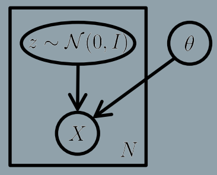
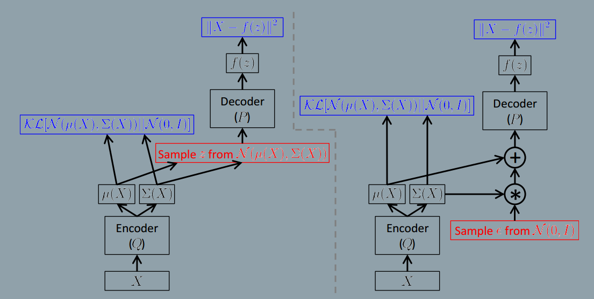
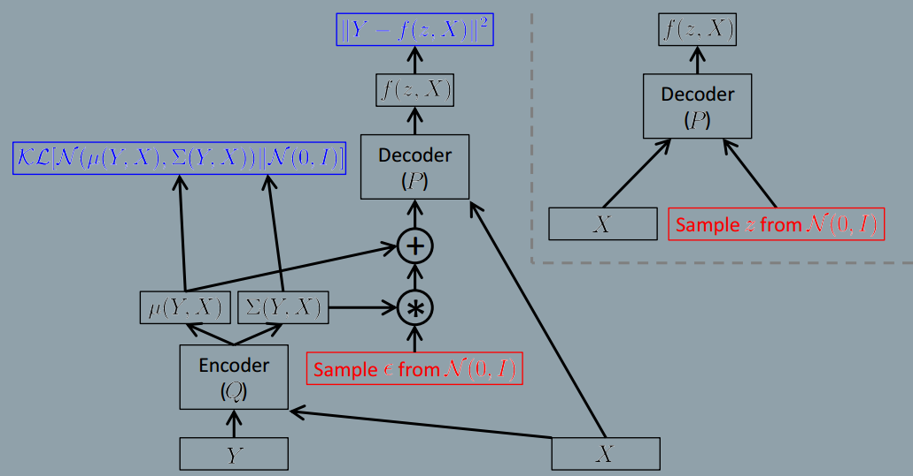

### Tutorial on Variational Autoencoders
###### published:2016-8
###### author:Carnegie Mellon/UC Berkeley
This tutorial is a good reading material for VAE. I copied some insight ideas about VAE in this note.

>VAEs are appealing because they are built on top of standard function approximators(neural networks), and can be trained with stochastic gradient descent.

>"Generative modeling" is a broad area of machine learning which deals with models of distributions P(X), defined over datapoints X in some potentially hight-dimensional space X.

> We can formalize this setup by saying that we get examples X distributed according to some unknown distribution $P_{gt}(X)$, and our goal is to learn a model $P$ which we can sample from, such that $P$ is as similar as possible to $P_{gt}$.

> When training a generative model, the more complicated the dependencies between the dimensions, the more difficult the models are to train.

>Intutively, it helps if the model first decides which character to generate before it assigns a value to any specific pixel. This kind of decision is formally called a **latent variable**. This is before our model draws anything, it first randomly samples a digit value z from the set [0,...,9], and then makes sure all the strokes match that character.

> Formally, say we have a vector of latent variables z in a high-dimensional space $\mathbb{Z}$ which we can easily sample according to some probability density function $P(z)$ defined over $\mathbb{Z}$. Then, say we have a family of deterministic functions $f(z;\theta)$, parameterized by a vector $\theta$ in some space $\Theta$, where $f:\mathbb{Z} * \Theta \rightarrow \chi$. f is deterministic, but if z is random and $\theta$ is fixed, then $f(z;\theta)$ is a random variable in the space $\chi$. We wish to optimize $\theta$ such that we can sample z from P(z) and, with high probability, $f(z; \theta)$ will be like the X's in our dataset.

>To make this notion precise mathematically, we are aiming maximize the probability of each X in the training set under the entire generative process, according to:

$$
P(X) = \int P(X\mid z;\theta)P(z)dz
$$
The standard VAD model represented as a graphical model in the following figure:

> The key is to notice that any distribution in d dimensions can be generated by taking a set of d variables that are normally distributed and mapping them through a sufficiently complicated fuction.

> Hance, provided powerful function approximators, we can simply learn a fuction which maps our independent, normally-distributed z values to whatever latent variables might be needed for the model, and then map those latent variables to X.

> If $f(z;\theta)$ is a multi-layer neural network, then we can imagine the network using its first few layers to map the normally distributed z's to the lantent values(like digit identity, stroke weight, angle, etc.) with exactly the right statitics.

> The key idea behind the variational autoencoder is to attempt to sample values of z that are likely to have produced X, and compute $P(X)$ just from those. This means that we need a new function $Q(z\mid X)$ which can take a value of X and give us a distribution over z values that are likely to produce X. Hopefully the space of z values that are likely under Q will be much smaller that the space of all z's that are likely under the prior P(z).

> The relationship between $E_{z\sim Q}P(X\mid z)$ and P(X) is one of the cornerstones of variational Bayesian methods.

$$
D[Q(z)\parallel P(z\mid X)] = E_{z\sim Q}[\log Q(z) - \log P(z\mid X)]
$$
applying Bayes rule to P(z|x):
$$
D[Q(z)\parallel P(z|X)] = E_{z\sim Q}[\log Q(z) - \log P(X|z) - \log P(z)] + \log P(X)
$$
reordering:
$$
\log P(x) - D[Q(z)||P(z|X)] = E_{z\sim Q}[\log P(X|z)] - D[Q(z)||P(z)]
$$
> Note that X is fixed, and Q can be any distribution, not just a distribution which does a good job mapping X to the z's that can produce X.

$$
\log P(x) - D[Q(z|X)||P(z|X)] = E_{z\sim Q}[\log P(X|z)] - D[Q(z|X)||P(z)]
$$

> Hence, as is standard in stochastic gradient descent, we take one sample of z and treat P(X|z) for that z as an approximation of $E_{z\sim Q}[\log P(X|z)]$.
> Using reparameter trick to back propogation errors.

The architecture is in following figures:

$$
E_{X\sim D}[E_{\varepsilon \sim N(0,I)}[\log P(X|z=\mu(X) + \Sigma^{1/2}(X)*\varepsilon)] - D[Q(z|X)||P(z)]]
$$

**Testing the learned model**
That is, we remove the "encoder," including the multiplication and addition operations that would change the distribution of z.

**Condition VAE**
$$
D[Q(z|Y,X)\parallel P(z\mid Y,X)] = E_{z\sim Q(.|Y,X)}[\log Q(z|Y,X) - \log P(z\mid Y,X)]
$$
$$
D[Q(z|Y,X)\parallel P(z|Y,X)] = E_{z\sim Q(.|Y,X)}[\log Q(z|Y,X) - \log P(Y|z,X) - \log P(z|X)] + \log P(Y|X)
$$
$$
\log P(Y|x) - D[Q(z|Y,X)||P(z|Y,X)] = E_{z\sim Q(.|Y,X)}[\log P(Y|z,X)] - D[Q(z|Y,X)||P(z|X)]
$$

