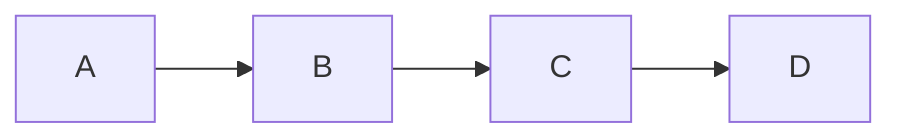

# H1
## H2
### H3

#### 无序列表
* 1
* 2
* 3

#### 有序列表
1. 1
2. 2
3. 3

> 例如这样

#### 插入图片

#### 插入链接
[BaiDu](http://baidu.com)

**粗体**   *斜体*

|    Tables      |     Are         |     Cool     |
|:----------------:|:---------------:|-------------:|
|    col 3 is       |  right-aligned  |     $1600    |
|    col 2 is       |  centered       |     $12      |
|    zebra stripes  |  are neat       |     $1       |

```python
  print('Hello world!')
```
***

- [x] 已完成的项目1
  - [ ] 已完成的事项1


